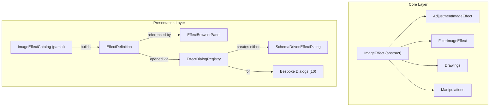

# Image Effects System — Architectural Redesign

## Current Architecture Summary

The existing system already has a **better** structure than the problem statement suggests. After a thorough audit, here's what actually exists today:



### What Adding an Effect Requires Today

| Step | File | When needed |
|------|------|-------------|
| 1 | `{EffectName}ImageEffect.cs` | Always |
| 2 | `ImageEffectCatalog.{Category}.cs` | Always (1 line) |
| 3 | [ImageEffectCatalog.Metadata.cs](file:///d:/Dev/GitHub/ShareX/ShareX/ShareX.ImageEditor/src/ShareX.ImageEditor/Presentation/Effects/ImageEffectCatalog.Metadata.cs) | Always (1 line) |
| 4 | Nothing else | **For most effects** — [SchemaDrivenEffectDialog](file:///d:/Dev/GitHub/ShareX/ShareX/ShareX.ImageEditor/src/ShareX.ImageEditor/Presentation/Views/Dialogs/SchemaDrivenEffectDialog.axaml.cs#62-66) handles UI |

The bespoke dialog path (`{EffectName}Dialog.axaml` + [.cs](file:///d:/Dev/GitHub/ShareX/ShareX/ShareX.ImageEditor/src/ShareX.ImageEditor/Core/ImageEffects/ImageEffect.cs) + [EffectDialogRegistry.cs](file:///d:/Dev/GitHub/ShareX/ShareX/ShareX.ImageEditor/src/ShareX.ImageEditor/Presentation/Views/Dialogs/EffectDialogRegistry.cs)) is only needed for the **10 effects** that have custom UIs too complex for the schema-driven dialog (e.g., DrawText, PerspectiveWarp, CropImage).

> [!IMPORTANT]
> The system is **not** as bad as described. For ~90% of effects, you only touch **3 files** (effect class + 2 catalog one-liners). The proposal to get down to **1 file** is achievable and worthwhile, but the current pain is moderate, not severe.

---

## Evaluation of Proposed Base Class

### Your Proposed API

```csharp
// Proposed
public abstract class ImageEffectBase
{
    string Alias;
    string Name;
    ImageEffectCategory Category;
    string Description;
    string Icon;
    bool HasParameters;
    SKBitmap Apply(SKBitmap source);
    void ShowDialog();
}
```

### Assessment

| Member | Verdict | Notes |
|--------|---------|-------|
| `Alias` | ⚠️ Rename → [Id](file:///d:/Dev/GitHub/ShareX/ShareX/ShareX.ImageEditor/src/ShareX.ImageEditor/Presentation/Controls/EffectBrowserPanel.axaml.cs#85-113) | "Alias" implies an alternate name. This is a primary identifier. Use [Id](file:///d:/Dev/GitHub/ShareX/ShareX/ShareX.ImageEditor/src/ShareX.ImageEditor/Presentation/Controls/EffectBrowserPanel.axaml.cs#85-113). |
| [Name](file:///d:/Dev/GitHub/ShareX/ShareX/ShareX.ImageEditor/src/ShareX.ImageEditor/Presentation/Effects/EffectDefinition.cs#120-131) | ✅ Keep | Display name for the effect |
| [Category](file:///d:/Dev/GitHub/ShareX/ShareX/ShareX.ImageEditor/src/ShareX.ImageEditor/Presentation/Effects/ImageEffectCatalog.cs#99-103) | ✅ Keep | Drives browser grouping |
| [Description](file:///d:/Dev/GitHub/ShareX/ShareX/ShareX.ImageEditor/src/ShareX.ImageEditor/Core/ImageEffects/Helpers/TypeExtensions.cs#53-67) | ✅ Keep | Currently in Metadata — good to co-locate |
| `Icon` | ✅ Keep | Currently in Metadata — good to co-locate |
| `HasParameters` | ✅ Keep | Already exists on [ImageEffect](file:///d:/Dev/GitHub/ShareX/ShareX/ShareX.ImageEditor/src/ShareX.ImageEditor/Core/ImageEffects/ImageEffect.cs#5-17); drives immediate-apply vs dialog path |
| [Apply()](file:///d:/Dev/GitHub/ShareX/ShareX/ShareX.ImageEditor/src/ShareX.ImageEditor/Core/ImageEffects/Filters/BlurImageEffect.cs#12-56) | ✅ Keep | Core contract — already exists |
| `ShowDialog()` | ❌ **Remove** | **This is the biggest design flaw.** See below. |

---

## Critical Design Issues

### 1. `ShowDialog()` Violates Separation of Concerns

Placing `ShowDialog()` on the effect class creates a **hard coupling** between `Core` and [Presentation](file:///d:/Dev/GitHub/ShareX/ShareX/ShareX.ImageEditor/src/ShareX.ImageEditor/Presentation/Effects/ImageEffectCatalog.cs#406-443):

- Effects in `Core/ImageEffects/` currently have **zero Avalonia dependencies**. This is by design — the STRUCTURE.md explicitly states: *"Core/ — Platform-agnostic. No Avalonia references. Safe to unit-test without UI."*
- `ShowDialog()` requires creating Avalonia controls, opening windows, handling UI events — all fundamentally presentation concerns.
- You'd need to either:
  - Move effects into the Presentation layer (losing testability), or
  - Add Avalonia references to Core (violating the architecture)

> [!CAUTION]  
> Embedding `ShowDialog()` in the effect class would destroy the Core/Presentation boundary, make effects untestable without a UI runtime, and create circular dependencies.

### 2. Missing: Parameter Schema

The current system's greatest strength is [EffectParameterDefinition](file:///d:/Dev/GitHub/ShareX/ShareX/ShareX.ImageEditor/src/ShareX.ImageEditor/Presentation/Effects/EffectParameterDefinition.cs#31-47) — a **declarative schema** that lets a single [SchemaDrivenEffectDialog](file:///d:/Dev/GitHub/ShareX/ShareX/ShareX.ImageEditor/src/ShareX.ImageEditor/Presentation/Views/Dialogs/SchemaDrivenEffectDialog.axaml.cs#62-66) render controls for any combination of sliders, checkboxes, enum dropdowns, color pickers, numeric inputs, text inputs, and file path pickers.

Your proposed base class has no mechanism for parameter declaration. Without this, each parameterized effect would need a custom dialog — which is exactly what the original ShareX codebase had and what you're trying to eliminate.

### 3. Missing: `BrowserLabel` vs [Name](file:///d:/Dev/GitHub/ShareX/ShareX/ShareX.ImageEditor/src/ShareX.ImageEditor/Presentation/Effects/EffectDefinition.cs#120-131)

Currently, effects with dialogs show `"Blur..."` in the browser (with trailing `...`) but display `"Blur"` in the dialog title. The proposed API has only [Name](file:///d:/Dev/GitHub/ShareX/ShareX/ShareX.ImageEditor/src/ShareX.ImageEditor/Presentation/Effects/EffectDefinition.cs#120-131), losing this UX pattern.

---

## Recommended Design

### Strategy: Attribute-Driven Self-Registration

Instead of a God-class base, use **attributes** to declaratively annotate effect classes with their metadata and parameter schemas. This achieves the "one file" goal while preserving the Core/Presentation boundary.

### Phase 1: `ImageEffectAttribute` (Metadata)

```csharp
// Core/ImageEffects/ImageEffectAttribute.cs

[AttributeUsage(AttributeTargets.Class, AllowMultiple = false, Inherited = false)]
public sealed class ImageEffectAttribute : Attribute
{
    public string Id { get; }
    public string Name { get; }
    public ImageEffectCategory Category { get; }
    public string Description { get; set; } = "";
    public string Icon { get; set; } = "";
    
    /// <summary>
    /// When true, the effect is applied immediately without opening a dialog.
    /// Defaults to true when the effect has no parameter properties.
    /// </summary>
    public bool ApplyImmediately { get; set; }
    
    /// <summary>
    /// When set, indicates this effect requires a bespoke editor
    /// rather than the auto-generated schema-driven dialog.
    /// </summary>
    public string? CustomEditorKey { get; set; }

    public ImageEffectAttribute(string id, string name, ImageEffectCategory category)
    {
        Id = id;
        Name = name;
        Category = category;
    }
}
```

### Phase 2: `EffectParameterAttribute` (Parameter Schema)

```csharp
// Core/ImageEffects/EffectParameterAttribute.cs

[AttributeUsage(AttributeTargets.Property, AllowMultiple = false)]
public sealed class EffectParameterAttribute : Attribute
{
    public string Label { get; }
    public EffectParameterKind Kind { get; set; } = EffectParameterKind.Auto;
    public double Minimum { get; set; } = double.NaN;
    public double Maximum { get; set; } = double.NaN;
    public double TickFrequency { get; set; } = 1;
    public bool IsSnapToTickEnabled { get; set; } = true;
    public string ValueFormat { get; set; } = "{}{0:0}";
    public int Order { get; set; } = int.MaxValue;
    public string? FileFilter { get; set; }

    public EffectParameterAttribute(string label)
    {
        Label = label;
    }
}

public enum EffectParameterKind
{
    Auto,       // Inferred from property type
    Slider,
    Numeric,
    Checkbox,
    Enum,
    Color,
    Text,
    FilePath
}
```

### Phase 3: What an Effect Looks Like After Refactoring

#### Simple parameterless effect (1 file, ~15 lines)

```csharp
// Core/ImageEffects/Adjustments/InvertImageEffect.cs

[ImageEffect("invert", "Invert", ImageEffectCategory.Adjustments,
    Description = "Inverts image colors.",
    Icon = LucideIcons.RefreshCcwDot,
    ApplyImmediately = true)]
public class InvertImageEffect : AdjustmentImageEffect
{
    public override SKBitmap Apply(SKBitmap source)
    {
        float[] matrix = {
            -1,  0,  0, 0, 1,
             0, -1,  0, 0, 1,
             0,  0, -1, 0, 1,
             0,  0,  0, 1, 0
        };
        return ApplyColorMatrix(source, matrix);
    }
}
```

#### Parameterized effect (1 file, ~25 lines)

```csharp
// Core/ImageEffects/Filters/BlurImageEffect.cs

[ImageEffect("blur", "Blur", ImageEffectCategory.Filters,
    Description = "Applies a blur effect.",
    Icon = LucideIcons.Focus)]
public class BlurImageEffect : FilterImageEffect
{
    [EffectParameter("Radius", Kind = EffectParameterKind.Slider,
        Minimum = 1, Maximum = 200)]
    public int Radius { get; set; } = 10;

    public override SKBitmap Apply(SKBitmap source) { /* ... */ }
}
```

#### Complex multi-parameter effect (1 file)

```csharp
// Core/ImageEffects/Adjustments/BrightnessImageEffect.cs

[ImageEffect("brightness", "Brightness", ImageEffectCategory.Adjustments,
    Description = "Adjusts image brightness.",
    Icon = LucideIcons.SunMedium)]
public class BrightnessImageEffect : AdjustmentImageEffect
{
    [EffectParameter("Amount", Minimum = -100, Maximum = 100)]
    public float Amount { get; set; } = 0;

    public override SKBitmap Apply(SKBitmap source) { /* ... */ }
}
```

### Phase 4: Reflection-Based Discovery & Catalog Builder

```csharp
// Presentation/Effects/ImageEffectCatalog.cs (replaces all partial files)

public static class ImageEffectCatalog
{
    private static readonly IReadOnlyList<EffectDefinition> _definitions;
    
    static ImageEffectCatalog()
    {
        _definitions = DiscoverEffects();
    }

    private static IReadOnlyList<EffectDefinition> DiscoverEffects()
    {
        return typeof(ImageEffect).Assembly
            .GetTypes()
            .Where(t => !t.IsAbstract && t.IsSubclassOf(typeof(ImageEffect)))
            .Select(t => (Type: t, Attr: t.GetCustomAttribute<ImageEffectAttribute>()))
            .Where(pair => pair.Attr != null)
            .Select(pair => BuildDefinition(pair.Type, pair.Attr!))
            .OrderBy(d => d.Category)
            .ThenBy(d => d.Name)
            .ToList()
            .AsReadOnly();
    }

    private static EffectDefinition BuildDefinition(Type effectType, ImageEffectAttribute attr)
    {
        var parameters = effectType.GetProperties()
            .Select(p => (Prop: p, Attr: p.GetCustomAttribute<EffectParameterAttribute>()))
            .Where(pair => pair.Attr != null)
            .OrderBy(pair => pair.Attr!.Order)
            .Select(pair => BuildParameterDefinition(effectType, pair.Prop, pair.Attr!))
            .ToArray();

        bool applyImmediately = attr.ApplyImmediately || 
            (!attr.ApplyImmediately && parameters.Length == 0);

        return new EffectDefinition(
            attr.Id,
            attr.Name + (applyImmediately ? "" : "..."),
            attr.Icon,
            attr.Description,
            attr.Category,
            () => (ImageEffect)Activator.CreateInstance(effectType)!,
            parameters,
            customEditorKey: attr.CustomEditorKey,
            applyImmediately: applyImmediately);
    }
}
```

### Phase 5: What Gets Deleted

After the migration, these files become **obsolete**:

| File | Reason |
|------|--------|
| [ImageEffectCatalog.Adjustments.cs](file:///d:/Dev/GitHub/ShareX/ShareX/ShareX.ImageEditor/src/ShareX.ImageEditor/Presentation/Effects/ImageEffectCatalog.Adjustments.cs) | Replaced by reflection discovery |
| [ImageEffectCatalog.Filters.cs](file:///d:/Dev/GitHub/ShareX/ShareX/ShareX.ImageEditor/src/ShareX.ImageEditor/Presentation/Effects/ImageEffectCatalog.Filters.cs) | Replaced by reflection discovery |
| [ImageEffectCatalog.Drawings.cs](file:///d:/Dev/GitHub/ShareX/ShareX/ShareX.ImageEditor/src/ShareX.ImageEditor/Presentation/Effects/ImageEffectCatalog.Drawings.cs) | Replaced by reflection discovery |
| [ImageEffectCatalog.Manipulations.cs](file:///d:/Dev/GitHub/ShareX/ShareX/ShareX.ImageEditor/src/ShareX.ImageEditor/Presentation/Effects/ImageEffectCatalog.Manipulations.cs) | Replaced by reflection discovery |
| [ImageEffectCatalog.Metadata.cs](file:///d:/Dev/GitHub/ShareX/ShareX/ShareX.ImageEditor/src/ShareX.ImageEditor/Presentation/Effects/ImageEffectCatalog.Metadata.cs) | Metadata moves to `[ImageEffect]` attributes |

Preserved:
| File | Reason |
|------|--------|
| [ImageEffectCatalog.cs](file:///d:/Dev/GitHub/ShareX/ShareX/ShareX.ImageEditor/src/ShareX.ImageEditor/Presentation/Effects/ImageEffectCatalog.cs) | Rebuilt as the reflection-based discovery engine |
| [EffectDefinition.cs](file:///d:/Dev/GitHub/ShareX/ShareX/ShareX.ImageEditor/src/ShareX.ImageEditor/Presentation/Effects/EffectDefinition.cs) | Still the runtime representation |
| [EffectParameterDefinition.cs](file:///d:/Dev/GitHub/ShareX/ShareX/ShareX.ImageEditor/src/ShareX.ImageEditor/Presentation/Effects/EffectParameterDefinition.cs) | Still needed, but `BuildParameterDefinition()` generates them from attributes |
| [EffectParameterState.cs](file:///d:/Dev/GitHub/ShareX/ShareX/ShareX.ImageEditor/src/ShareX.ImageEditor/Presentation/Effects/EffectParameterState.cs) | Unchanged — still drives the UI bindings |
| `SchemaDrivenEffectDialog.axaml(.cs)` | Unchanged — still renders generic dialogs |
| [EffectDialogRegistry.cs](file:///d:/Dev/GitHub/ShareX/ShareX/ShareX.ImageEditor/src/ShareX.ImageEditor/Presentation/Views/Dialogs/EffectDialogRegistry.cs) | Still needed for the ~10 bespoke dialogs |
| All `{EffectName}ImageEffect.cs` files | Enhanced with attributes, but logic untouched |

---

## Potential Pitfalls & Mitigations

### 1. Icon Constants in Core

`LucideIcons` is in `Presentation/Theming/`. If we use icon constants in `[ImageEffect]` attributes on Core classes, we'd create a Core → Presentation dependency.

**Mitigation:** Use plain strings for icons in the attribute, and either:
- **(a)** Move `LucideIcons` constants to Core (they're just Unicode strings, no Avalonia dependency), or
- **(b)** Use string literals in attributes: `Icon = "\ue900"` with a Core-side `EffectIcons` class

> [!TIP]
> Option (a) is cleanest. `LucideIcons` is just `public const string Focus = "\ue900"` — no UI dependency.

### 2. Reflection Performance

Discovery happens **once** at startup via a static constructor. With ~100 effect types to scan, this takes <10ms. Not a concern.

### 3. Attribute Limitations for Complex Parameter Types

Attributes only support compile-time constants. This means:
- **Color defaults** can't use `Colors.Orange` — use `DefaultColorArgb = 0xFFFFA500` (uint)
- **Enum options** need a different approach — the attribute auto-discovers enum values from the property type
- **Complex factory patterns** (like `GlowImageEffect(20, 80f, ...)`) need a `SetDefaults()` override

```csharp
// For effects with complex construction defaults:
[ImageEffect("glow", "Glow", ImageEffectCategory.Filters, ...)]
public class GlowImageEffect : FilterImageEffect
{
    [EffectParameter("Size", Minimum = 1, Maximum = 100)]
    public int Size { get; set; } = 20;
    
    [EffectParameter("Strength", Minimum = 1, Maximum = 100, ValueFormat = "{}{0:0}%")]
    public float Strength { get; set; } = 80f;
    
    // Property defaults replace the factory lambda
    public bool AutoResize { get; set; } = true;
    
    public override SKBitmap Apply(SKBitmap source) { /* ... */ }
}
```

### 4. Bespoke Dialogs Still Need Manual Registration

The 10 bespoke dialogs (DrawText, PerspectiveWarp, etc.) can't be fully auto-discovered because they involve custom AXAML. However, [EffectDialogRegistry.cs](file:///d:/Dev/GitHub/ShareX/ShareX/ShareX.ImageEditor/src/ShareX.ImageEditor/Presentation/Views/Dialogs/EffectDialogRegistry.cs) already handles this cleanly with its switch expression.

**Future enhancement:** Use a `[BespokeDialogFor("perspective_warp")]` attribute on the dialog class itself, and discover those via reflection too.

### 5. Host Manipulation Shortcuts

Effects like "Rotate 90° clockwise" are handled by the host/ViewModel, not by [ImageEffect](file:///d:/Dev/GitHub/ShareX/ShareX/ShareX.ImageEditor/src/ShareX.ImageEditor/Core/ImageEffects/ImageEffect.cs#5-17) classes. These will still need explicit registration in `EffectBrowserPanel.cs`.

**Mitigation:** This is acceptable — there are only ~6 of these, and they're fundamentally different from [ImageEffect](file:///d:/Dev/GitHub/ShareX/ShareX/ShareX.ImageEditor/src/ShareX.ImageEditor/Core/ImageEffects/ImageEffect.cs#5-17)-based effects.

---

## Migration Strategy

### Phased Approach (Recommended)


| Phase | Scope | Risk |
|-------|-------|------|
| **1** | Create `ImageEffectAttribute` + `EffectParameterAttribute` | None — additive only |
| **2** | Build reflection discoverer alongside existing catalog | None — runs in parallel |
| **3** | Annotate effect classes one category at a time, verify parity | Low — testable per-category |
| **4** | Delete `ImageEffectCatalog.{Category}.cs` + [Metadata.cs](file:///d:/Dev/GitHub/ShareX/ShareX/ShareX.ImageEditor/src/ShareX.ImageEditor/Presentation/Effects/ImageEffectCatalog.Metadata.cs) | Medium — point of no return |
| **5** | Update docs | None |

> [!NOTE]
> Phase 3 can be done incrementally — annotate a few effects, verify they appear correctly in the browser with matching parameters, then do the next batch. The discoverer can merge attribute-discovered effects with legacy catalog entries.

---

## Final Comparison

| Concern | Current | Proposed (yours) | Recommended |
|---------|---------|-------------------|-------------|
| Files per new effect | 1-3 | 1 | **1** ✅ |
| Core/Presentation boundary | ✅ Clean | ❌ Broken by `ShowDialog()` | ✅ Preserved |
| Parameter schema | ✅ Declarative | ❌ Missing | ✅ Attribute-driven |
| Auto-discovery | ❌ Manual catalog | ✅ Reflection | ✅ Reflection |
| Testability | ✅ No UI deps in Core | ❌ UI in effect class | ✅ No UI deps in Core |
| Bespoke dialog support | ✅ Registry | ❓ Unclear | ✅ Attribute + Registry |
| Metadata co-location | ❌ Separate file | ✅ In effect class | ✅ In effect class via attribute |

---

## Summary

1. **Don't add `ShowDialog()` to the effect class.** This is the single most impactful recommendation. It would break the clean Core/Presentation separation that the existing architecture correctly maintains.

2. **Use attributes instead of inheritance for metadata.** `[ImageEffect]` and `[EffectParameter]` attributes on the existing effect classes achieve the "one file" goal without changing the class hierarchy.

3. **Build a reflection-based discoverer** to replace the hand-written `ImageEffectCatalog.{Category}.cs` partial files. This eliminates the catalog registration step entirely.

4. **Keep the existing infrastructure** ([EffectDefinition](file:///d:/Dev/GitHub/ShareX/ShareX/ShareX.ImageEditor/src/ShareX.ImageEditor/Presentation/Effects/EffectDefinition.cs#30-132), [SchemaDrivenEffectDialog](file:///d:/Dev/GitHub/ShareX/ShareX/ShareX.ImageEditor/src/ShareX.ImageEditor/Presentation/Views/Dialogs/SchemaDrivenEffectDialog.axaml.cs#62-66), [EffectParameterState](file:///d:/Dev/GitHub/ShareX/ShareX/ShareX.ImageEditor/src/ShareX.ImageEditor/Presentation/Effects/EffectParameterState.cs#31-46)) — it's well-designed and battle-tested. Just generate [EffectDefinition](file:///d:/Dev/GitHub/ShareX/ShareX/ShareX.ImageEditor/src/ShareX.ImageEditor/Presentation/Effects/EffectDefinition.cs#30-132) instances from attributes instead of hand-writing them.

5. **Migrate incrementally** — annotate effects one category at a time while running both discovery paths in parallel for verification.
