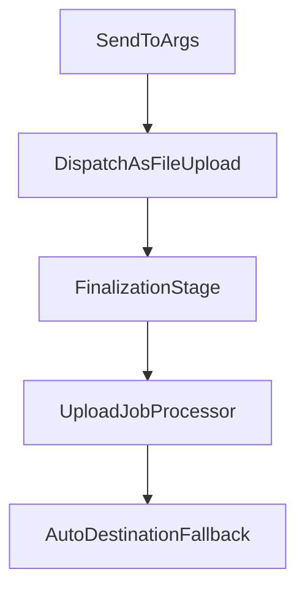
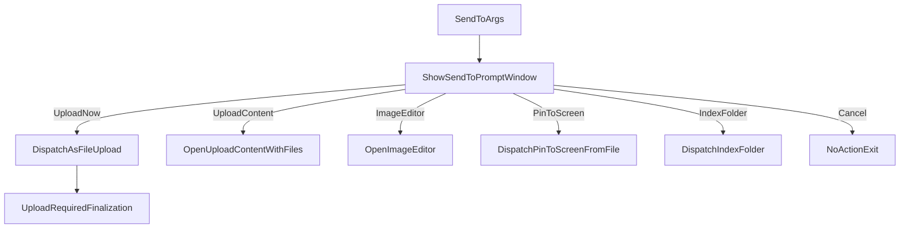

# XIP0055 Send-To Upload Behavior Control

**Status**: Complete
**Version**: v0.22.257

**Priority**: High  
**Audit date**: 2026-03-24  
**Related**: Shell integration file handoff behavior, FileUpload workflow

---

## Executive Summary

`Send to XerahS` currently routes incoming files into `FileUpload`, which enforces upload completion and triggers auto-uploader fallback. This is correct for upload-first workflows but problematic for users who use Send-to as a local handoff/import action.

This XIP proposes a dedicated Send-to prompt window (styled similarly to `AfterCaptureWindow`) so users choose the action explicitly each time files are sent to XerahS.

The goal is to stop implicit upload behavior and make Send-to intent explicit, while preserving the existing context-menu entry that already means "Upload with XerahS."

---

## Problem Statement

Current Send-to handling executes a strict upload path:

1. Shell integration argument handling schedules incoming file uploads in `Program.cs`.
2. Incoming files are started as `WorkflowType.FileUpload` and `TaskJob.FileUpload`.
3. Finalization requires upload success for `TaskJob.FileUpload`.
4. Auto destination fallback attempts File and Image categories when no uploader is available.

Observed runtime symptoms include repeated logs such as:

- "Auto destination selected; trying uploaders with fallback for category File."
- "No available uploaders for category File (excluding already attempted)."
- "File is an image; trying Image category uploaders as fallback..."

This behavior creates poor UX for tester and onboarding environments where shell integration is enabled but uploader providers are not configured yet.

---

## Code Audit Baseline (2026-03-24)

### Send-to dispatch always assumes upload

- `src/desktop/app/XerahS.App/Program.cs`
  - `ProcessIncomingArguments(...)` extracts file paths and schedules `UploadFilesFromIntegrationAsync(...)`.
  - `UploadFilesFromIntegrationAsync(...)` sets `settings.Job = WorkflowType.FileUpload` and calls `StartFileTask(...)` for each file.

### File upload jobs are treated as upload-required

- `src/desktop/core/XerahS.Core/Tasks/Pipeline/FinalizationStage.cs`
  - `ShouldRequireSuccessfulUpload(...)` returns `true` for `TaskJob.FileUpload` and `TaskJob.TextUpload`.
  - Upload failure therefore fails the task for file-upload jobs.

### Auto fallback tries cross-category uploaders

- `src/desktop/core/XerahS.Core/Tasks/Processors/UploadJobProcessor.cs`
  - `TryUploadWithFallback(...)` attempts prioritized instances, then category fallback.
  - For image files under File category, it falls back into Image category uploaders.

These baseline details explain why Send-to currently implies upload and why no-uploader environments can produce repeated fallback logs.

---

## Goals

1. Make Send-to behavior explicitly configurable and understandable.
2. Allow Send-to usage without requiring any uploader configuration.
3. Preserve current upload behavior for existing users by default.
4. Keep implementation scoped to Send-to integration (no broad workflow redesign).
5. Improve logs to show why upload was skipped or attempted.

## Non-Goals

- Replacing existing uploader fallback logic globally.
- Redesigning all workflow categories or task jobs.
- Changing watch-folder semantics in this XIP.
- Removing upload-first behavior for users who explicitly want it.

---

## Proposal

### Send-to prompt window (always shown for Send-to)

When XerahS is invoked via Send-to, show an action-selection prompt before dispatching workflow logic.

Prompt actions:

- `Upload now` -> existing `WorkflowType.FileUpload` path
- `Open in Upload Content` -> queue/review flow
- `Open in Image Editor` (only when selection is image-compatible)
- `Pin to Screen` (only when selection is image-compatible) -> `WorkflowType.PinToScreenFromFile`
- `Index folder` (only when selection contains folders) -> `WorkflowType.IndexFolder`
- `Cancel`

Prompt characteristics:

- Layout and wording style aligned with `AfterCaptureWindow` for consistency.
- Contextual action availability (for example, hide/disable image-only actions for non-image files).
- Optional "Remember this choice" can be deferred; not required for initial implementation.

### Runtime dispatch change

Replace hardcoded Send-to dispatch (`WorkflowType.FileUpload`) with:

1. Parse incoming Send-to files.
2. Show prompt window.
3. Dispatch according to selected action.
4. On cancel, do nothing and return success.

### Action intelligence and workflow mapping

Send-to input should be classified before rendering actions:

- `allFiles`: one or more files, no directories.
- `allFolders`: one or more directories, no files.
- `mixed`: both files and directories.
- `allImages`: all selected files are image-compatible.

Action availability rules:

- Always available: `Upload now`, `Open in Upload Content`, `Cancel`.
- `Open in Image Editor` and `Pin to Screen`: available only for `allImages`.
- `Index folder`: available for `allFolders`; for `mixed`, show as `Index folders only` and apply only to directory entries.

Action to workflow mapping:

- `Upload now` -> `WorkflowType.FileUpload`
- `Open in Upload Content` -> open Upload Content window with pre-populated entries (no auto-upload)
- `Open in Image Editor` -> `WorkflowType.ImageEditor` per image file
- `Pin to Screen` -> `WorkflowType.PinToScreenFromFile` per image file
- `Index folder` -> `WorkflowType.IndexFolder` per folder

---

## Functional Requirements

1. Send-to argument processing must show the prompt before task creation.
2. `Upload now` must remain functionally identical to current FileUpload behavior.
3. `Open in Upload Content` must not auto-start upload unless user explicitly triggers it in that UI.
4. `Open in Image Editor` and `Pin to Screen` must be available only when file type supports them.
5. `Index folder` must be available when at least one folder is present in Send-to input.
6. Selected prompt action must be logged once per Send-to invocation for diagnostics.
7. Multi-item Send-to operations must apply chosen action consistently, with documented behavior for mixed file/folder sets.

## Non-Functional Requirements

1. No regressions for manual upload, clipboard upload, or watch-folder upload flows.
2. Minimal added startup overhead in Send-to path.
3. Clear and testable separation between upload-required and non-upload file intake.
4. No new persistent setting is required for initial delivery.

---

## Architecture and Flow

### Current behavior

### Proposed behavior

---

## Key Files for Implementation

### Configuration

- No configuration schema changes required for initial implementation.

### Send-to dispatch

- `src/desktop/app/XerahS.App/Program.cs`
  - Show Send-to prompt in `ProcessIncomingArguments(...)` flow.
  - Classify incoming file/folder/image set and route selected action.
  - Route selected action to upload, upload-content window, image editor, pin-to-screen, index-folder, or cancel.

### Task pipeline / job semantics

- `src/desktop/core/XerahS.Core/Tasks/Pipeline/FinalizationStage.cs`
  - No semantic change required if only `Upload now` uses FileUpload path.

### Settings UX

- `src/desktop/app/XerahS.UI/Views/AfterCaptureWindow.axaml` (reference style)
- New prompt view/viewmodel for Send-to action selection.

---

## UX Copy Draft

Prompt title:

- `How should XerahS handle sent files?`

Prompt actions:

- `Upload now`
- `Open in Upload Content`
- `Open in Image Editor` (when applicable)
- `Pin to Screen` (when applicable)
- `Index folder` (when folders are selected)
- `Cancel`

---

## Risks and Mitigations

1. **Prompt friction**: extra click for users who always upload.  
   **Mitigation**: keep dedicated "Upload with XerahS" context menu behavior unchanged.

2. **Prompt unavailable in non-interactive contexts**: UI cannot render in some invocation paths.  
   **Mitigation**: deterministic fallback to current upload behavior when prompt cannot be shown.

3. **Action mismatch on mixed file types**: image-only action may not fit all files.  
   **Mitigation**: disable image-editor action unless all selected files are supported.

4. **Routing complexity increase**: more action branches in Send-to dispatch.  
   **Mitigation**: centralize action-to-workflow mapping and add routing tests.

5. **Mixed file/folder ambiguity**: users may expect one action to apply to all entries.  
   **Mitigation**: show clear action scope text (for example, "Index folders only") and summary before confirm.

---

## Verification Matrix

| Scenario | Config | Expected Result |
|------|------|------|
| No uploaders configured, Send-to image | Prompt -> Upload now | Upload path runs and fails clearly (expected current behavior) |
| No uploaders configured, Send-to image | Prompt -> Open in Upload Content | File opens in queue UI without auto-upload |
| Send-to image | Prompt -> Open in Image Editor | Editor opens with sent file |
| Send-to image | Prompt -> Pin to Screen | Image pins to screen via file workflow |
| Send-to folder | Prompt -> Index folder | Folder indexing workflow runs |
| Send-to file (non-image) | Prompt | Image-editor option hidden/disabled |
| Send-to mixed (file + folder) | Prompt -> Index folder | Folder entries are indexed; files are skipped with info note |
| Multi-file Send-to | Prompt -> Upload now | All files dispatched through FileUpload path |
| Prompt canceled | Prompt -> Cancel | No task started; no error surface |

Manual log checks:

- Confirm chosen prompt action is logged once with item classification (`allFiles`, `allFolders`, `mixed`, `allImages`).
- Confirm behavior decision log appears once per Send-to batch.

---

## Rollout Plan

1. Implement Send-to prompt window (view + viewmodel).
2. Wire prompt into Send-to argument handling and action dispatch.
3. Add contextual enable/disable logic for image-only and folder-only actions.
4. Add tests for classification/routing (files, folders, mixed) and cancel behavior.
5. Publish release note clarifying "Upload with XerahS" vs Send-to prompt behavior.

---

## Success Criteria

1. Send-to no longer implies immediate upload without user confirmation.
2. Dedicated "Upload with XerahS" context-menu flow remains upload-first and unchanged.
3. Folder and image Send-to paths can trigger `IndexFolder` and `PinToScreenFromFile` from the prompt when applicable.
4. No regressions in non-Send-to upload workflows.