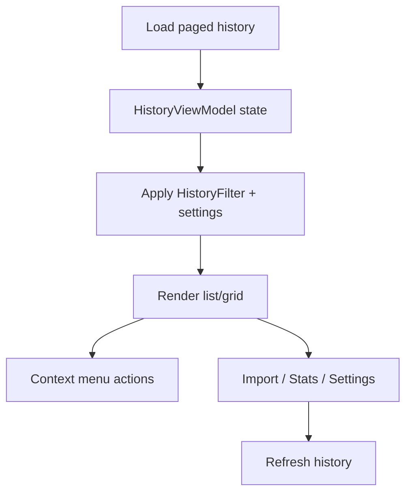

# XIP0056 History ImageHistory Feature Parity

**Status**: PROPOSED  
**Priority**: High  
**Audit date**: 2026-03-24  
**Related**: ShareX `ImageHistoryForm`, ShareX `HistoryForm`, XerahS `HistoryView`

---

## Executive Summary

ShareX `ImageHistory` and `History` windows include mature filtering, history settings, import/stats utilities, preview and list-virtualization behaviors, and a broad context-action surface that are only partially represented in XerahS History today.

This XIP proposes a scoped parity track to bring the highest-value `ImageHistory` and `HistoryForm` capabilities into XerahS History without cloning WinForms UX one-to-one. The intent is to preserve XerahS design language while closing practical workflow gaps for power users.

---

## Problem Statement

Current XerahS History provides modern list/grid views, pagination, selection, and several item actions, but misses key capabilities users expect from ShareX history workflows:

1. No first-class search/filter toolbar in desktop history UI.
2. No user-configurable history settings surface (thumbnail size, max items, missing-file filtering, image-only mode, etc.).
3. No built-in history import-folder workflow from UI.
4. No history statistics output action.
5. Context action set is narrower than ShareX `HistoryItemManager` (especially URL variants and rich copy formats).
6. No advanced search panel equivalent (URL/date/type/host filters) from ShareX `HistoryForm`.
7. No drag-out file export interaction from history selection.

These gaps reduce discoverability and increase friction for users migrating from ShareX who rely on history as an operational hub.

---

## Code Audit Baseline (2026-03-24)

### ShareX capabilities audited

- `../ShareX/ShareX.HistoryLib/Forms/ImageHistoryForm.cs`
  - Wildcard search (`*`, `?`) with optional tag matching.
  - Favorites-only toggle.
  - Auto-complete source populated from process-name tags.
  - Optional missing-file filtering and image-only filtering.
  - Incremental/lazy append with max-item cap and auto-load-more.
  - Import folder action and stats output action.
  - History settings dialog integration.

- `../ShareX/ShareX.HistoryLib/ImageHistorySettings.cs`
  - `ThumbnailSize`, `MaxItemCount`, `AutoLoadMoreItems`, `FilterMissingFiles`, `ImageOnly`, `RememberSearchText`, `RememberWindowState`, `Favorites`.

- `../ShareX/ShareX.HistoryLib/Forms/HistoryForm.cs`
  - Advanced search panel with `Filename`, `URL`, `Date range`, `Type`, `Host` filters and reset/close actions.
  - Live simple search on text change plus explicit advanced filtering.
  - Title/status includes total, filtered, and grouped type distribution.
  - Thumbnail preview pane updates with selected item (image file or image URL).
  - List virtualization (`VirtualMode`) and item cache windows for large histories.
  - Drag-and-drop file export from selected history entries.
  - Splitter distance persistence as part of window state behavior.

- `../ShareX/ShareX.HistoryLib/HistorySettings.cs`
  - `SplitterDistance`, `RememberSearchText`, `Favorites`, window-state persistence fields.

- `../ShareX/ShareX.HistoryLib/HistoryItemManager.cs`
- `../ShareX/ShareX.HistoryLib/HistoryItemManager_ContextMenu.cs`
  - Extensive context menu and shortcut coverage:
  - Open URL/file variants, copy URL/file variants, HTML/BBCode/Markdown formats, tag/favorite/edit/rename/delete, upload/edit/pin/analyze actions.

### XerahS current baseline

- `src/desktop/app/XerahS.UI/ViewModels/HistoryViewModel.cs`
  - Has pagination, list/grid toggle, refresh, multi-select, combine images, and common actions (open/edit/upload/copy/delete).
  - Does not currently expose search/filter state or settings-driven filtering in the view model flow.

- `src/desktop/app/XerahS.UI/Views/HistoryView.axaml`
  - Modern toolbar and collection visuals exist.
  - No search box/filter controls/history-settings entry/import/stats controls.

- `src/desktop/core/XerahS.History/HistoryFilter.cs`
  - Filtering primitives already exist in core (filename/url/date/type/host/favorites/search-in-tags/max-count), but are not surfaced as a full user-facing desktop history feature set.

---

## Goals

1. Deliver practical parity for core ShareX `ImageHistory` and `HistoryForm` workflows in XerahS desktop History.
2. Add filter/search UX and persistent history settings without regressing current History performance.
3. Expand context actions where parity is high value and platform-safe.
4. Integrate import/stats tools into History for power-user operations.
5. Keep implementation aligned with XerahS UX standards and skill-guided UI workflow.

## Non-Goals

- Full pixel-perfect replication of WinForms menu/layout structures.
- Porting every ShareX context action in one release if low-value or platform-hostile.
- Mobile parity in this XIP (desktop-first scope).
- Replacing existing pagination architecture with virtualized infinite scrolling in this phase.

---

## Proposal

### 1) History filter and search toolbar

Add a top-row filter/search strip in desktop History with:

- Text search (`FileName`) using ShareX-compatible wildcard semantics (`*`, `?`).
- `Search in tags` toggle.
- `Favorites only` toggle.
- Optional quick toggles for `Image only` and `Hide missing files`.
- Visible result metadata (`Total` vs `Filtered`).

Behavior:

- Search/filter updates should be explicit (`Enter` or Search button) and support refresh.
- Filtering is applied in view-model pipeline using `HistoryFilter` as canonical logic host.

### 1.1) Advanced filter panel parity

Add an expandable advanced filter panel (desktop) inspired by ShareX `HistoryForm`:

- `Filename` filter.
- `URL` contains filter.
- Date range filter (`From` / `To`).
- Type filter (localized display names mapped to underlying type keys).
- Host filter.
- `Reset` and `Close` actions.

Behavior:

- Advanced controls apply without blocking UI.
- Simple search and advanced filter states are composed predictably.
- Advanced filter state is visually clear to avoid ambiguous result sets.

### 2) History settings UI

Introduce a History settings dialog/window for desktop with persisted settings:

- Thumbnail dimensions.
- Max visible item count.
- Auto-load-more behavior.
- Filter missing files.
- Image-only mode.
- Remember search text.
- Remember window state (or XerahS-equivalent view-state persistence).

### 3) Import and stats actions

Add toolbar actions:

- `Import folder` for appending discoverable files into history store.
- `Show stats` output (counts by type/host/date summary equivalent to current helper capability).

### 4) Context menu parity expansion

Expand existing History item flyout/menu in phases:

- **Phase A (must-have parity)**: favorite toggle, tag edit, rename file, delete item vs delete file+item.
- **Phase B (high-value copy parity)**: URL/short URL/thumbnail URL/deletion URL copies where data exists; markdown/html variants.
- **Phase C (extended actions)**: analyze image and additional niche formatting commands.

Multi-select behavior should mirror ShareX intent:

- Single-item: enable full detail actions conditionally.
- Multi-item: disable item-specific edit actions, keep bulk copy/delete actions.

### 5) Incremental loading semantics

Preserve XerahS paging model, but add ShareX-like incremental behavior compatibility through settings:

- Respect configured max item cap in filtered results.
- Optional "auto load more" on scroll-end/thumbnail completion events.
- Avoid UI-thread stalls and preserve background thumbnail loading.

### 6) History preview and interaction parity

Add high-value `HistoryForm` interaction patterns:

- Optional right-side preview pane for selected item (image file/image URL when available).
- Drag selected existing files from History to file explorer or other apps (`FileDrop`) where platform supports it.
- Status/title metadata showing counts and optional type distribution summary.

---

## Scope and Design Workflow Requirements

This XIP explicitly requires the following project skills to be part of implementation scope:

1. `.ai/skills/frontend-design`
   - Use for control hierarchy, spacing consistency, and interaction density decisions in `HistoryView` and related shared components.
2. `.ai/skills/design-ui-window`
   - Use for any new dialog/window flows (History settings, optional import/stats presentation windows) including layout and action ergonomics.
3. Avalonia docs MCP
   - Draw implementation details from Avalonia official documentation via MCP for control behavior, virtualization patterns, selection models, drag-and-drop APIs, and desktop interaction best practices.

Definition of done for UI scope includes evidence that both skill playbooks were applied during implementation review.

---

## Functional Requirements

1. History UI exposes wildcard search and applies it against filename with optional tag search.
2. Favorites-only filter is available and persisted between sessions.
3. Settings UI allows users to configure and persist thumbnail size, max count, auto-load-more, missing-file filter, image-only mode, and remember-search behavior.
4. `Import folder` action appends discovered entries and refreshes current history view safely.
5. `Show stats` action provides readable aggregate output for current/full history set.
6. Context menu supports separate delete-item and delete-file-and-item actions with confirmation.
7. Context menu enables/disables actions based on item count and available fields (URL/file/image/text).
8. Advanced filter panel supports URL/date/type/host filtering and reset behavior.
9. History supports drag-out file export for existing selected files on supported platforms.
10. History supports selecting multiple items and deleting them in one action with clear confirmation messaging.

## Non-Functional Requirements

1. No regressions to existing History open/edit/upload/delete flows.
2. Filtering and refresh operations remain responsive with large history sets.
3. New settings are backward compatible with existing config stores.
4. Keyboard workflows remain supported for primary actions.
5. Large-history rendering remains stable with virtualization/caching strategy.

---

## Architecture and Flow

---

## Key Files for Implementation

### Desktop UI / ViewModel

- `src/desktop/app/XerahS.UI/Views/HistoryView.axaml`
  - Add search/filter controls, advanced filter panel, and toolbar actions (`Import folder`, `Stats`, `Settings`).
- `src/desktop/app/XerahS.UI/ViewModels/HistoryViewModel.cs`
  - Add filter state, advanced filter composition, search execution command, settings-backed behavior, context-action expansion, drag-out/file-export support, and import/stats command wiring.

### Core history/filter/settings

- `src/desktop/core/XerahS.History/HistoryFilter.cs`
  - Ensure wildcard and tag-search behavior exactly matches intended ShareX parity.
- `src/desktop/core/XerahS.History/ImageHistorySettings.cs`
  - Extend/align settings schema for UI-driven behavior flags and defaults.

### Supporting UI components

- `src/desktop/app/XerahS.UI/...` (new settings window/viewmodel and optional stats surface)
  - Implement with `.ai/skills/design-ui-window` guidance.

---

## Risks and Mitigations

1. **Feature bloat in context menu**  
   **Mitigation**: phase rollout and keep advanced copy formats grouped/collapsible.

2. **Filter confusion due to many toggles**  
   **Mitigation**: keep default quick filters minimal and push advanced controls to settings.

3. **Performance regression on large histories**  
   **Mitigation**: maintain paging, apply filtering efficiently, use list virtualization/caching strategy, and avoid full UI rebind churn where possible.

4. **Cross-platform behavior variance**  
   **Mitigation**: gate file-system-dependent actions behind platform capability checks.

---

## Verification Matrix

| Scenario | Setup | Expected Result |
|------|------|------|
| Filename wildcard search | Query `*error*` | Matching items shown, non-matches hidden |
| Tag-inclusive search | `Search in tags = true` | Tag matches included |
| Favorites mode | Toggle favorites-only | Only favorite items visible |
| Missing-file filter | `Hide missing files = true` | Non-existent file paths excluded |
| Advanced URL/date/type/host filter | Enable each advanced control | Filtered set matches combined criteria |
| Import folder | Select folder with mixed files | Supported entries imported and view refreshed |
| Stats action | History has mixed hosts/types | Stats output includes aggregated counts |
| Multi-select context menu | Select 3 items | Bulk copy/delete enabled, single-item edit actions disabled |
| Delete file+item | Confirm action | File removed from disk (if exists) and history entry removed |
| Drag-out history items | Select existing files and drag | External drop target receives file paths |

---

## Rollout Plan

1. Deliver filter/search toolbar plus advanced filter panel and view-model filter pipeline.
2. Deliver history settings window and persistence.
3. Deliver import/stats toolbar actions.
4. Deliver context-menu parity Phase A, then Phase B.
5. Run UX pass using `.ai/skills/frontend-design` and `.ai/skills/design-ui-window`.
6. Validate via matrix and manual keyboard/selection/drag-drop smoke tests.

---

## Success Criteria

1. XerahS desktop History supports ShareX-style wildcard filtering and favorites mode.
2. Users can configure key history behavior from a dedicated settings surface.
3. Import/stats and high-value context actions are available without degrading existing UX.
4. Advanced filtering and drag/export interactions from ShareX `HistoryForm` are represented in XerahS history scope.
5. Implementation evidence references application of `.ai/skills/frontend-design` and `.ai/skills/design-ui-window`.

