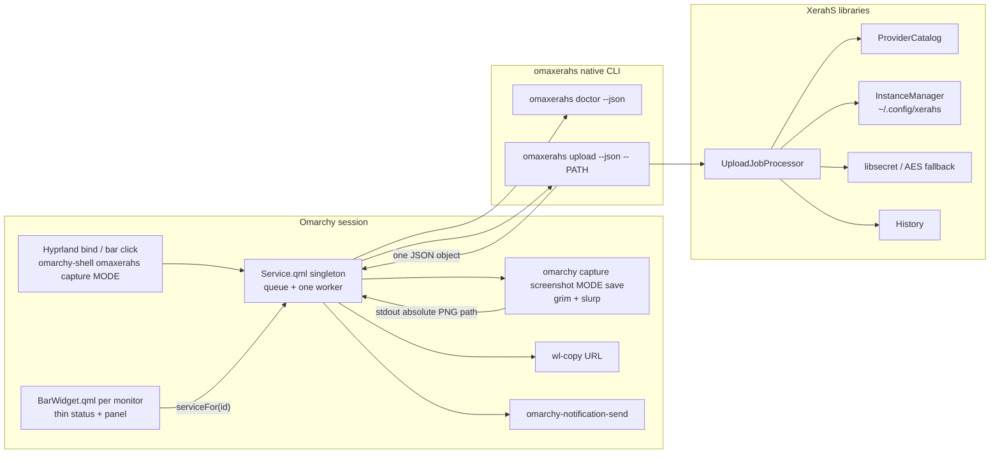
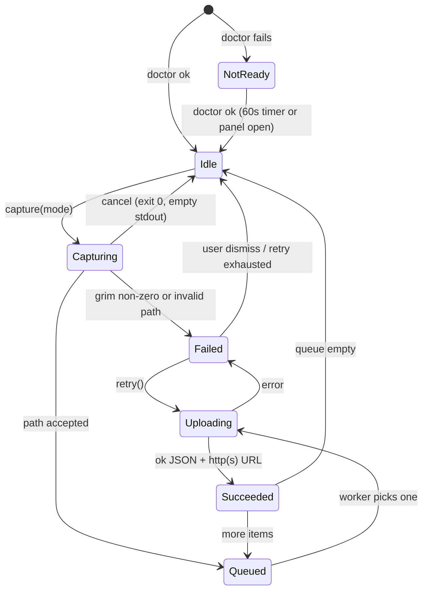

# OmaXerahs: Omarchy Screenshot Upload via XerahS Destinations

| Field | Value |
| --- | --- |
| **Title** | OmaXerahs — Omarchy-first XerahS screenshot upload plugin and CLI |
| **Author** | Grok design-doc-writer |
| **Date** | 2026-09-02 |
| **Status** | Draft |
| **Related** | XIP0087, XIP0063, XIP0075, XIP0076, XIP0079, XIP0082, XIP0083 |
| **Omarchy reviewed** | `C:\Users\Public\source\repos\omacom\omarchy` (capture, plugins, IPC, bindings) |
| **XerahS reviewed** | `C:\Users\Public\source\repos\ShareX Team\XerahS` at the XIP-cited CLI/packaging surface (`672b258c013e3fa49d669f3f718a888d1c0374a3` blockers verified in current tree) |

---

## Overview

Omarchy already captures screenshots with `grim`/`slurp` through `omarchy-capture-screenshot`. XerahS already owns provider plugins, destination instances, libsecret-backed credentials, upload history, and after-upload workflow. The missing piece is a **safe adapter**: take the exact file Omarchy just wrote and submit it to the user's configured **image** destination, then copy the resulting URL and notify once.

This design does **not** extend `xerahscli` as the Omarchy contract. At the current XerahS tree, `xerahscli` is an agent-oriented kitchen-sink CLI whose Linux packages do not even install it, and whose upload defaults route PNGs as generic files, force clipboard copy, randomize filenames, and can contaminate JSON stdout with toasts. Those are not a small patch; they are a second product contract.

The product family is **OmaXerahs** (`oma` + `xerahs`):

| Role | Name |
| --- | --- |
| Product / plugin family | OmaXerahs |
| Plugin id | `io.github.sharex.omaxerahs` |
| IPC target | `omaxerahs` |
| CLI binary | `omaxerahs` |
| Plugin git repo | `ShareX/omaxerahs` (marketplace root) |
| CLI project | `src/desktop/cli/XerahS.OmaXerahs/` inside the XerahS monorepo |

The plugin is an adapter. It never implements providers, never reads secrets, never watches the clipboard, never replaces Omarchy capture, and never enables automatic upload on install. Version one is **explicit capture-and-upload** driven by `omarchy capture screenshot <mode> save`. Opt-in directory observation is specified so it can land as a follow-up without redesigning the singleton.

---

## Background & Motivation

### What Omarchy already does

`bin/omarchy-capture-screenshot` is the only capture implementation this plugin may use. It:

1. Resolves `OUTPUT_DIR` from `OMARCHY_SCREENSHOT_DIR`, else `XDG_PICTURES_DIR`, else `$HOME/Pictures`.
2. Creates that directory if missing.
3. Freezes the screen, runs `omarchy-capture-region`, captures with `grim`.
4. Names files `screenshot-YYYY-MM-DD_HH-MM-SS.png`.
5. Honors processing mode:

| Mode (`$2`) | File | stdout path | Clipboard | Notification |
| --- | --- | --- | --- | --- |
| `slurp` (default) | yes | yes | image/png via `wl-copy` | yes, with editor `--exec` |
| `copy` | **no** | no | image/png only | no |
| `save` | yes | yes | **no** | **no** |

Supported region modes (`$1`): `smart`, `region`, `windows`, `fullscreen`. Cancel (empty slurp selection, or `pkill slurp` dismiss) exits 0 with no path.

Stock binding in `default/hypr/bindings/utilities.lua`:

```lua
o.bind("PRINT", "Screenshot", "omarchy-capture-screenshot")
```

The menu action is the same binary (`default/omarchy/omarchy-menu.jsonc` → `trigger.capture.screenshot`). There is **no** `screenshot-completed` D-Bus signal, plugin hook, or post-capture event anywhere in the Omarchy tree (verified by search). XIP0087 was correct on this point. The XIP path `default/quickshell/omarchy/services/PluginService.qml` is stale; the live registry is `shell/services/PluginRegistry.qml`.

### Why a plugin, not a patched screenshot script

Marketplace plugins must not rewrite packaged binaries or Hyprland bindings. `omarchy-plugin-add` clones a public git repo, validates `manifest.json` at the repo root, and never runs install hooks or `sudo`. The adapter therefore lives as a third-party plugin under `~/.config/omarchy/plugins/<id>/` and talks to the running shell through `IpcHandler` (`omarchy-shell <target> <method>`).

### What XerahS already does — and where `xerahscli` fails Omarchy

The real upload seam is already correct:

```text
UploadCommand / (new OmaXerahs host)
  → ShareXBootstrap (headless)
  → CliUploaderBootstrapper-equivalent: ProviderCatalog + InstanceManager
  → UploadJobProcessor.ProcessAsync
  → EDataType switch → UploaderCategory.Image | File | Text
  → secret store (LinuxLibsecretSecretStore or AES fallback)
  → history append
```

`UploadJobProcessor` (`src/desktop/core/XerahS.Core/Tasks/Processors/UploadJobProcessor.cs`) routes `EDataType.Image` to `UploaderCategory.Image`. That is the destination users configure in the GUI.

`xerahscli upload` does **not** take that path today. In `UploadCommand.cs`:

- A PNG is classified with `FileHelpers.IsTextFile` / `--as-file`, never `FileHelpers.IsImageFile`.
- `taskInfo.DataType` is `EDataType.Text` or `EDataType.File` — never `EDataType.Image`.
- `CliUploaderBootstrapper.GetReadinessCategories(false)` returns **only** `[UploaderCategory.File]`.
- `taskSettings.AfterUploadJob` is forced to `AfterUploadTasks.CopyURLToClipboard`.
- Filename randomization via temp copy is the default (`--no-randomize` exists but is opt-in).
- `HeadlessToastService.ShowToast` writes `[NOTIFICATION] …` to **stdout**.
- JSON errors are written to stdout *and* the human message is written to stderr; a toast can precede the JSON object.
- `doctor uploaders` has `--json` and `--fix`, but no `--category` and no `--quiet`. `--fix` mutates instances (Paste2 / img.fish bootstrap) — the plugin must never call it.

Linux packaging confirms the other XIP blocker: `build/linux/package-linux.sh` publishes `XerahS.App`; AUR `build/linux/aur/xerahs-git/PKGBUILD` and `build/linux/repo-staging/xerahs.spec` symlink only `/usr/bin/xerahs`. Grep of `build/` finds **zero** `xerahscli` install rules.

`XerahS.CLI.csproj` is also the wrong binary to ship for this job: it references Assistant, RegionCapture, VideoEditor (including a `frontend/dist` publish requirement), WatchFolder daemon, and every discovered uploader plugin. Local Debug output is `net10.0-windows10.0.26100.0` when built on Windows. Independent `xerahscli` processes share `InstanceManager`'s in-process `lock` around `uploader-instances.json` — no cross-process lock.

### Plugin model that actually exists

Omarchy hosts one `omarchy-shell` process. Third-party plugins are git checkouts with `manifest.json` at git root. `omarchy plugin validate` enforces schemaVersion 1, required fields, reserved `omarchy.*` ids, safe relative entry points, kind/entryPoint pairing, and **no symlinks**. Marketplace listing (`https://plugins.omarchy.org/publish.html`) is a schema/listing check, not a security review; plugins run unsandboxed.

The correct singleton pattern is **`omarchy.media`**, not Dropbox/Tailscale:

- Media: `kinds: ["service", "bar-widget"]`, host loads `Service.qml` once via `shell.ensureService`, widgets call `bar.shell.serviceFor(id)` / `firstPartyServiceFor`. `IpcHandler { target: "media" }` lives on the service.
- Dropbox/Tailscale: `kinds: ["bar-widget"]` only; `Service { }` is a **child of each Panel**. That would duplicate watchers and upload workers on multi-monitor bars. Do not copy it.

Bar widgets receive `settings` from the `shell.json` layout entry (`shell/Ui/BarWidget.qml`). Enabling a dual-kind third-party plugin places it on the bar (`PluginRegistry.setEnabled`); the id's presence enables the service. `inotify-tools` is already an Omarchy base package and is how `PluginRegistry` itself watches `~/.config/omarchy/plugins/`.

Community naming (install conventions only; do **not** copy capture UX): `omasnap`, `omashot`, `omanote`, `omanews`, `omastonk`, `okomart`, `omasettings`, `omasync`. Typical install is `omarchy plugin add https://github.com/<owner>/<repo>.git`. Overlay plugins such as omashot expose `omarchy-shell <id> <method>`.

---

## Goals & Non-Goals

### Goals

1. Upload a screenshot that Omarchy already captured to the user's configured XerahS **image** destination.
2. Reuse `XerahS.Core` / `XerahS.Uploaders` / secret store / history — no second provider stack.
3. Explicit capture-and-upload in v1: `omarchy capture screenshot <mode> save` → exact path → one upload.
4. Machine-readable JSON at the process boundary; plugin owns Wayland clipboard copy and Omarchy notification.
5. Opt-in automatic upload remains **off** unless the user enables it (v1 does not ship the observer; the setting must not appear as a silent default).
6. Multi-monitor safety: one service, one queue worker, one CLI process at a time.
7. Marketplace-valid dedicated plugin repo; native Arch/Omarchy install of the CLI on `PATH`.
8. Preserve every local screenshot; removal leaves XerahS config, secrets, and history intact.

### Non-Goals

- Replacing or wrapping grim/slurp/omarchy-capture-screenshot.
- Clipboard watchers or clipboard-as-screenshot inference.
- Provider APIs, OAuth, or secrets in QML/shell.
- Silent Hyprland / `shell.json` / XerahS settings edits.
- Shipping `xerahscli` as the Omarchy dependency.
- Flatpak XerahS in v1.
- Uploading recordings, OCR text, or arbitrary files in v1.
- Upstream Omarchy screenshot-completed event as a v1 blocker.
- Extracting an Avalonia-free `XerahS.UploadHost` library in v1 (see Alternatives).
- Automatic directory observation in the first marketplace release.

---

## Proposed Design

### Recommendation: independent Omarchy-first CLI

**Ship `omaxerahs`, do not wait on a `xerahscli` contract/packaging expansion.**

| Criterion | Extend `xerahscli` | Dedicated `omaxerahs` |
| --- | --- | --- |
| Linux packaging | Must add a large extra payload (VideoEditor web UI, watchfolder, capture, assistant) that packages currently omit entirely | Add one extra native binary next to `XerahS` in `/usr/lib/xerahs/` |
| Image routing | Must add `--type`, change default PNG classification, stop File-instance ID leak, without breaking OpenClaw/agent callers who rely on File + clipboard + randomize | Image-only defaults; no agent compatibility surface |
| JSON isolation | Must rewire `HeadlessToastService` (stdout today), `PrintError`, quiet mode for every existing command | Toast is a no-op; stdout is one JSON object by construction |
| Defaults | Plugin would need `--type image --json --quiet --no-randomize --no-clipboard --no-notify --` on every call, and those flags do not all exist | Frozen Omarchy contract: those are the only behaviours |
| Process isolation | Still a general CLI other tools will invoke concurrently | Plugin is the primary caller; file lock is simpler to reason about |
| Size of change | Contract + packaging + regression risk across capture/record/workflow/openclaw | New slim host over the same Core pipeline |

A "small `xerahscli` patch" is not actually small: it is at least image routing, readiness categories, destination-id clearing, toast/stdout isolation, clipboard/notify switches, category doctor, JSON schema version, cross-process settings lock, **and** first-class Linux packaging of a binary that currently pulls VideoEditor's `frontend/dist` as a publish requirement. That work still leaves Omarchy coupled to an evolving agent CLI.

`omaxerahs` still **must** call into XerahS libraries. It must not reimplement Imgur, S3, custom uploaders, OAuth, or `uploader-instances.json`.

### Naming

**Chosen (user-confirmed): `omaxerahs`.** Display name **OmaXerahs**. Plugin id, IPC target, CLI binary, and plugin repo all use this family. Do not publish under `omarahs`.

| Candidate | Status |
| --- | --- |
| **omaxerahs** | **Chosen.** `oma` + `xerahs`. Plugin id `io.github.sharex.omaxerahs`, IPC `omaxerahs`, binary `omaxerahs`, repo `ShareX/omaxerahs`, project `XerahS.OmaXerahs`. |
| omarahs | Rejected alternate (`oma` + `rahs`). Unused. |
| omaxup | Rejected alternate; function-clear but weaker XerahS brand. |
| omahost | Rejected; easy to confuse with HTTP hosting. |

### Repository layout

Marketplace install (`omarchy plugin add <git-url>`) requires `manifest.json`, `README.md`, and `LICENSE` at the **git root**. Nesting the plugin inside the XerahS monorepo cannot satisfy that without a synthetic extra repo or marketplace changes. Therefore:

```text
ShareX/XerahS                          ShareX/omaxerahs  (public, marketplace)
├── src/desktop/cli/XerahS.OmaXerahs/    ├── manifest.json
│   ├── XerahS.OmaXerahs.csproj          ├── Service.qml
│   ├── Program.cs                     ├── BarWidget.qml
│   ├── Commands/                      ├── Panel.qml
│   │   ├── DoctorCommand.cs           ├── Model.js
│   │   └── UploadCommand.cs           ├── tests/
│   └── Services/                      ├── README.md
│       ├── HeadlessToastService.cs    ├── LICENSE          (MIT for plugin code)
│       ├── HeadlessUIService.cs       └── preview.png
│       └── UploadHost.cs
├── tests/…OmaXerahs…
└── build/linux/ … copy omaxerahs binary into App payload
```

- **CLI license:** GPL (links `XerahS.Core`). Lives only in the XerahS tree.
- **Plugin license:** MIT, matching Omarchy third-party plugins. No GPL code copied into the plugin repo.
- v1 has **no** plugin `scripts/` directory. Capture and upload are `Quickshell.Io.Process` argv arrays in `Service.qml`. A later observer PR may add `scripts/watch-screenshots.sh`; it must not vendor a .NET publish directory.

### How `omaxerahs` locates XerahS config, plugins, and secrets

Install `omaxerahs` **next to** the desktop binary so `AppContext.BaseDirectory` matches the GUI:

```text
/usr/lib/xerahs/XerahS
/usr/lib/xerahs/omaxerahs
/usr/lib/xerahs/Plugins/…
/usr/bin/xerahs   → ../lib/xerahs/XerahS
/usr/bin/omaxerahs  → ../lib/xerahs/omaxerahs
```

Then existing `PathsManager` behaviour is reused, not reimplemented:

| Resource | Resolution (Linux, no PersonalFolder override) |
| --- | --- |
| Settings | `LinuxXdgDirectories.ConfigDirectory` → `~/.config/xerahs` |
| Uploader instances | `~/.config/xerahs/uploader-instances.json` |
| History | `Path.Combine(StateDirectory, AppResources.HistoryFolderName)` → `~/.local/state/xerahs/History` |
| Bundled plugins | `Path.Combine(AppContext.BaseDirectory, "Plugins")` plus user plugin dirs from `GetPluginDirectories()` |
| Secrets | `SecretStore`: `LinuxLibsecretSecretStore` service `"XerahS"` if `secret-tool`/libsecret is available; else AES-GCM `SecretsStore.json` + `SecretsStore.key` beside settings |
| Screenshot files | **Host paths** passed as argv. Native install can read them. Flatpak remains unsupported. |

`omaxerahs` bootstraps with `ShareXBootstrap.InitializeAsync` using:

```csharp
new BootstrapOptions
{
    EnableLogging = true,          // DebugHelper file/debug only — must not write to stdout
    InitializeRecording = false,   // same gate xerahscli uses for non-record commands
    UIService = new HeadlessUIService(),   // VideoEditor-free stub; no ShareX.VideoEditor.Hosting
    ToastService = new HeadlessToastService() // no-op; never Console.WriteLine
}
```

It still calls `ProviderCatalog.LoadPlugins(PathsManager.GetPluginDirectories())` and `InstanceManager.Instance`. `ShareXBootstrap.InitializeAsync` still wires `WatchFolderManager` onto the host services object; `omaxerahs` must not start the watch-folder daemon or call `WatchFolderManager` APIs. JSON isolation tests fail the build if bootstrap or `DebugHelper` emits to stdout.

**Cross-process settings lock (Core, not omaxerahs-only).** `InstanceManager` today uses only `lock (_lock)` and `File.WriteAllText` on `~/.config/xerahs/uploader-instances.json`. An `omaxerahs`-only runtime lock on `$XDG_RUNTIME_DIR/xerahs/upload.lock` would **not** serialize GUI or `xerahscli` writers. v1 therefore puts the file lock **inside `InstanceManager` load/save** so every process that uses Core (desktop app, `omaxerahs`, `xerahscli`, watch-folder daemon) takes it:

- Lock file: `Path.Combine(PathsManager.SettingsFolder, "uploader-instances.lock")` (same directory as the JSON; survives a missing `$XDG_RUNTIME_DIR` and is shared by GUI + CLIs).
- Exclusive lock around `LoadConfiguration` / `SaveConfiguration` (and any repair that writes). Hold only for the disk critical section, not for the HTTP upload.
- Linux: `FileStream` with `FileShare.None` (or `flock` equivalent). Stale locks: wait up to 5s, then fail the CLI with `timeout` rather than corrupting JSON.
- Plugin-side single-worker serialization remains; it only prevents two `omaxerahs` children from the plugin, not a GUI save.

Do not claim GUI safety until PR-CLock lands in Core.

### CLI surface the plugin will call

`omaxerahs` is **not** a general ShareX CLI. It does not capture, record, notify, copy to clipboard, randomize names, or mutate destinations.

```bash
omaxerahs doctor --json
omaxerahs upload --json -- /absolute/path/screenshot.png
```

Optional flags exist for tests and humans; the plugin always uses `--json` and end-of-options `--`:

| Flag | Default | Plugin uses |
| --- | --- | --- |
| `--json` | **true** when stdout is not a TTY; plugin always passes it | yes |
| `--type` | `image` | omitted (default) |
| `--no-randomize` | **true** (original basename) | n/a |
| clipboard | **off** | n/a |
| notify/toast | **off** (no-op toast service) | n/a |
| `--fix` | **absent** (doctor is read-only) | never |

Doctor is category-specific **image** readiness. It must not create Paste2/img.fish instances. Exit `0` iff a **usable Image-category** uploader exists (provider loaded, `Category == Image`, instance available, `ValidateSettings` true). A File-category instance of a multi-category provider (S3, Dropbox, …) does **not** count. Secret-store fallback is reported but is not by itself a hard failure.

### Fail-closed Image routing (no File fallback)

Setting `taskInfo.DataType = EDataType.Image` is **necessary but not sufficient**. `UploadJobProcessor.UploadWithPluginSystem` already switches Image → `UploaderCategory.Image`, then three later paths still send work to File:

1. No Image instance → `"No Image uploader configured; falling back to File-category instances."` → `TryUploadWithFallback`.
2. `TryUploadWithFallback` after any non-File primary: *“If primary category failed (or had no uploaders), try File category uploaders as fallback.”* (and the inverse File→Image for image filenames).
3. `ResolveRequestedInstance` **continues** on a category mismatch (`Expected Image, got File. Continuing with configured instance.`).

`omaxerahs` must not take those paths. Add `TaskSettings.AllowCrossCategoryFallback` default **`true`** (GUI / `xerahscli` unchanged). `omaxerahs` sets it **`false`** after cloning the FileUpload workflow settings.

When `AllowCrossCategoryFallback == false`:

- Doctor and upload share the same rule: no usable Image instance → `not_ready`, no upload.
- `ResolveRequestedInstance` returns null on category mismatch (do not continue with a File instance).
- Missing Image default → error result, **do not** call `TryUploadWithFallback` for File.
- Auto-within-Image is allowed (try other Image instances). Auto must not then walk File.
- Image dest present but the Image upload fails, File dest ready → `provider` error, **no** File upload.
- Never set `DestinationInstanceId` from the File-category workflow; keep it `null` and resolve the Image default.

This is a small Core change in `UploadJobProcessor` + `TaskSettings`, not a second uploader stack. PR-C3 must include: Image dest present but failing, File dest ready → error JSON, no File HTTP.

`omaxerahs --version` / `omaxerahs capabilities --json` expose the contract the plugin probes before doctor:

```json
{
  "schemaVersion": 1,
  "name": "omaxerahs",
  "version": "0.1.0",
  "minPluginProtocol": 1,
  "capabilities": ["doctor.image", "upload.image"]
}
```

The plugin refuses to upload if `schemaVersion` is missing or `minPluginProtocol > 1` until it is updated.

### .NET placement and Avalonia reality

Place the project at `src/desktop/cli/XerahS.OmaXerahs/`.

```xml
<TargetFramework>net10.0</TargetFramework>
<OutputType>Exe</OutputType>
<AssemblyName>omaxerahs</AssemblyName>
```

Project references (Linux):

- `XerahS.Bootstrap`
- `XerahS.Core` (pulls Uploaders, History, UploaderPluginSdk)
- `XerahS.Platform.Linux` / `XerahS.Platform.Abstractions`
- `System.CommandLine`

Do **not** reference `XerahS.Assistant`, `XerahS.WatchFolder.Daemon`, `ShareX.VideoEditor`, or CLI capture/record commands.

**Transitive payload (accepted in v1).** `XerahS.Core.csproj` also references `ShareX.ImageEditor`, `XerahS.Media`, `XerahS.Indexer`, and `XerahS.RegionCapture`. Those DLLs ship with `omaxerahs`. This is still far smaller than `XerahS.CLI` (Assistant, WatchFolder daemon project, `ShareX.VideoEditor` plus the unconditional `frontend/dist` publish requirement in `CopyVideoEditorWebUiForPublish`). Size expectations: a **third self-contained Core host** (App + `xerahs-watchfolder-daemon` + `omaxerahs`), not a 1 MB helper. Self-contained single-file duplicates Core/Avalonia/ImageEditor/Skia; budget on the order of another **80–150 MB uncompressed** per RID, comparable to the daemon, until an upload-only library exists.

**Avalonia:** a dedicated CLI **cannot** currently reference `XerahS.Core` without pulling Avalonia assemblies. Core uses `Avalonia.Input` in hotkey/config types. Extracting an upload-only library is a large monorepo split and is **out of v1**. `omaxerahs` ships those DLLs but does not initialize an Avalonia application or show windows.

Target framework is `net10.0` (not `net10.0-windows*`) for Linux publish. Windows developers building the project must pass `-r linux-x64`/`linux-arm64` or build on Linux CI.

### Packaging for Arch / Omarchy

v1 requires a **native** PATH tool. Do not put the .NET publish inside the plugin repo. Do **not** `dotnet publish` OmaXerahs *into* the `XerahS.App` publish directory: `package-linux.sh` publishes only `XerahS.App` with `-p:PublishSingleFile=true --self-contained true`, then copies plugins into `PUBLISH_DIR/Plugins`. A second full publish tree would overwrite or mix assemblies.

Copy the existing **`xerahs-watchfolder-daemon` recipe** (`XerahS.App.csproj` `PublishWatchFolderDaemon` / `ValidatePublishedWatchFolderDaemon`, `package-linux.sh` `validate_daemon_bundle`):

1. Add `PublishOmaXerahs` AfterTargets=`Publish` on `XerahS.App.csproj` (or an equivalent step in `package-linux.sh` that the App target already uses for the daemon):
   - Publish `XerahS.OmaXerahs.csproj` **self-contained, `PublishSingleFile=true`**, same `RuntimeIdentifier` as the App, into an **intermediate** dir (`$(IntermediateOutputPath)omaxerahs-publish/$(RuntimeIdentifier)/`).
   - Copy **only** `omaxerahs` and `omaxerahs.runtimeconfig.json` (Linux requires the runtimeconfig, same as the daemon) into `$(PublishDir)` — i.e. next to `XerahS` and `Plugins/`, not into a nested folder.
   - Do not copy the rest of the OmaXerahs publish tree (duplicate Avalonia/Skia/ImageEditor files stay in the intermediate dir and are discarded).
2. `ValidatePublishedOmaXerahs`: fail if `$(PublishDir)/omaxerahs` or `omaxerahs.runtimeconfig.json` is missing.
3. `package-linux.sh`: `validate_omaxerahs_bundle` mirroring `validate_daemon_bundle`.
4. PATH + mode, in **all** of: AUR `build/linux/aur/xerahs-git/PKGBUILD`, `build/linux/repo-staging/xerahs.spec`, `build/linux/repo-staging/debian/rules`, and `build/linux/XerahS.Packaging` (CreateDeb/RPM/AppImage chmod lists):
   - `chmod 755 /usr/lib/xerahs/omaxerahs`
   - `ln -s ../lib/xerahs/omaxerahs /usr/bin/omaxerahs` (in addition to the existing `xerahs` symlink)
5. Release-asset check fails if the tarball omits `omaxerahs`. This is the check XIP wanted for `xerahscli`, applied to this binary instead. **Does not** add `xerahscli`.
6. Plugin README: install native `xerahs` ≥ the version that first contains `omaxerahs`; `command -v omaxerahs`.
7. Flatpak: detect (`FLATPAK_ID`, or `omaxerahs` missing while a Flatpak XerahS is present) and surface `cli_flatpak`. Do not request `--filesystem=home`.

`AppContext.BaseDirectory` sharing `Plugins/` only works because the copied `omaxerahs` binary lives in `/usr/lib/xerahs/` beside `Plugins/`. A nested publish folder would break plugin discovery.

This is a **third** Core host in the payload (App + watchfolder daemon + omaxerahs), shipped **inside the `xerahs` native package** (not a split AUR `omaxerahs`). Extra uncompressed size is on the order of another 80–150 MB per RID because the single-file host duplicates the runtime; do not describe it as “one extra native binary” in the kilobyte sense.

### What `omaxerahs` deliberately does not do

Omarchy owns these; the CLI must not duplicate them:

- Screen capture, region pickers, freezes, grim/slurp.
- Desktop notifications.
- Wayland clipboard (`wl-copy` / `wl-paste`).
- Watching directories or the clipboard.
- Destination selection UI or `--fix` mutation.
- Deleting or rewriting the source PNG.

### Plugin identity

```json
{
  "schemaVersion": 1,
  "id": "io.github.sharex.omaxerahs",
  "name": "OmaXerahs",
  "version": "0.1.0",
  "author": "ShareX Team",
  "license": "MIT",
  "description": "Upload Omarchy screenshots with your configured XerahS image destination.",
  "kinds": ["service", "bar-widget"],
  "keepLoaded": true,
  "entryPoints": {
    "service": "Service.qml",
    "barWidget": "BarWidget.qml"
  },
  "barWidget": {
    "displayName": "OmaXerahs",
    "description": "Capture and upload a screenshot through XerahS.",
    "category": "Files",
    "allowMultiple": false,
    "defaultSection": "right",
    "defaults": {
      "copyUrlToClipboard": true,
      "notifyOnComplete": true,
      "openUrlOnNotificationClick": false,
      "captureMode": "smart"
    },
    "schema": [
      {
        "key": "copyUrlToClipboard",
        "type": "boolean",
        "label": "Copy URL to clipboard after upload",
        "defaultValue": true
      },
      {
        "key": "notifyOnComplete",
        "type": "boolean",
        "label": "Notify when upload finishes",
        "defaultValue": true
      },
      {
        "key": "openUrlOnNotificationClick",
        "type": "boolean",
        "label": "Open URL when the notification is clicked",
        "defaultValue": false
      },
      {
        "key": "captureMode",
        "type": "enum",
        "label": "Capture mode for the bar button",
        "options": ["smart", "region", "windows", "fullscreen"],
        "defaultValue": "smart"
      }
    ]
  }
}
```

- **Plugin id:** `io.github.sharex.omaxerahs` (stable once published; not `omarchy.*`).
- **Kinds:** `service` + `bar-widget`, matching `shell/plugins/services/media/`.
- **IPC target:** `omaxerahs` on the **service**, not on the widget (widgets exist per monitor).
- **keepLoaded:** true so disable/enable and bar relayout do not drop in-flight work unexpectedly; host still destroys the service when the plugin is disabled (`shell.unloadPluginServices` / `_syncServices`).

v1 schema does **not** include `autoUploadEnabled`. Shipping a visible toggle that does nothing, or a toggle that turns on a heuristic observer, is worse than omitting it until the observer PR.

`captureMode` uses `type: "enum"`. That is accepted by the current bar settings UI: `shell/plugins/agents/manifest.json` already declares `syncMode` as `"type": "enum"` with `options`. Keep `captureMode` as an enum; do not store it as an untyped string.

### Architecture



### Explicit capture-and-upload flow (v1)

This is the only upload path in the first release.

```mermaid
sequenceDiagram
  participant User
  participant Hypr as Hyprland / bar
  participant IPC as omarchy-shell omaxerahs
  participant Svc as Service.qml
  participant Cap as omarchy capture screenshot
  participant CLI as omaxerahs
  participant XS as XerahS.Core pipeline

  User->>Hypr: Super+Shift+Print (user-added bind)
  Hypr->>IPC: capture smart
  IPC->>Svc: capture("smart")
  Note over IPC: omarchy-shell IPC timeout defaults to 2s
  Svc-->>IPC: {"ok":true,"accepted":true,"state":"capturing"}
  Svc->>Cap: argv ["omarchy","capture","screenshot","smart","save"]
  Note over Cap: User picks region; grim writes PNG
  Cap-->>Svc: stdout /home/…/screenshot-….png  exit 0
  Svc->>Svc: validate regular file, PNG, basename, canonical path
  Svc->>CLI: omaxerahs upload --json -- PATH
  CLI->>XS: EDataType.Image, AllowCrossCategoryFallback=false, no clipboard, no toast, original name
  XS-->>CLI: URL + identities
  CLI-->>Svc: one JSON object, exit 0
  Svc->>Svc: accept only case-sensitive http:// or https:// URL
  Svc->>User: wl-copy URL (if setting)
  Svc->>User: omarchy-notification-send (if setting; no --exec unless setting on)
```

`bin/omarchy-shell` sets `ipc_timeout=${OMARCHY_SHELL_IPC_TIMEOUT:-2s}` and waits for the IPC return. The documented Hyprland bind (`omarchy-shell omaxerahs capture smart`) therefore **requires** `capture()` to return JSON within that 2s window. Region picking and upload run asynchronously after accept. If `capture()` blocked on slurp, `timeout` would kill the IPC call and the bind would look broken.

Implementation rules:

1. `IpcHandler` on the **service** (typed QML signatures, same style as `media`):
   ```qml
   IpcHandler {
     target: "omaxerahs"
     function capture(mode: string): string { return root.capture(mode) }
     function status(): string { return root.statusJson() }
     function retry(): string { return root.retry() }
   }
   ```
   `capture(mode)` validates `mode ∈ {smart,region,windows,fullscreen}` and returns immediately with JSON. Invalid mode → `{"ok":false,"error":{"code":"invalid_mode",…}}`. v1 does **not** expose `pause` / `resume`.
2. Capture is a `Quickshell.Io.Process` with a **literal argv array** (never `bash -c`, never a plugin shell wrapper). Timeout ~120s.
   - **Cancel** = process exit 0 **and** empty stdout (empty slurp / `pkill slurp` in `omarchy-capture-screenshot`). Silent: no notify, no clipboard, state → `Idle`.
   - **Capture failure** = non-zero exit (grim `|| exit 1`: disk, permissions, grim crash) **or** stdout path that fails validation. State → `Failed`, critical `omarchy-notification-send`, no clipboard, no upload.
3. Parse stdout as a single absolute path (trim). Reject if empty (cancel if exit 0), relative, not a regular file, not `*.png`, basename not matching `^screenshot-[0-9]{4}-[0-9]{2}-[0-9]{2}_[0-9]{2}-[0-9]{2}-[0-9]{2}\\.png$`, or if `realpath`/`canonicalFilePath` disagrees after resolving symlinks. Re-stat immediately before upload (TOCTOU).
4. Pass the canonical path as one argv element after `--`.
5. Require CLI exit 0 **and** `ok: true` **and** `url` matching the **case-sensitive** prefix `http://` or `https://` (scheme lowercase). `HTTPS://` fail-closes. Otherwise fail closed.
6. Clipboard: `Quickshell.execDetached(["wl-copy", url])` only — argv, no `bash -c`. Copy **only** on success and only if `copyUrlToClipboard`. Never copy error text. Never replace clipboard on failure.
7. Notification: `omarchy-notification-send --app-name OmaXerahs -g <glyph> "Screenshot uploaded" "<host> / <filename>" --image "$path"` (local PNG thumbnail; persistent UI shows host + filename, full URL on clipboard). **v1 does not pass `--exec`.** `openUrlOnNotificationClick` default **false**; only when that setting is true may the plugin add `--exec` with a browser open of the URL. Use `-u normal` on success, `-u critical` on capture failure / auth / not-ready.
8. Source PNG is never deleted, moved, or rewritten.

**BarWidget + Panel** follow the **clock** pattern (`shell/plugins/panels/clock/BarWidget.qml`), not Dropbox (service-in-panel) and not media (no details panel). `BarWidget.qml` is the `barWidget` entry point: it looks up the singleton via `bar.shell.serviceFor("io.github.sharex.omaxerahs")`, shows status, left-click runs `uploadService.capture(settings.captureMode)`, and hosts a `Loader` for `Panel.qml`. The widget forwards `opened` / `open()` / `close()` / `toggle()` for `shell.summon` / `hide` as the clock does. `Panel.qml` is UI only (last result, Capture, Retry). The service stays a host-loaded singleton.

Bar button: left-click runs `service.capture(settings.captureMode)`. Panel offers Capture and Retry (when last result is failed). No Pause/Resume in v1.

Documented Hyprland examples (copyable only; plugin never writes `bindings.lua`):

```lua
-- Dedicated shortcut; stock Print unchanged.
o.bind("SUPER + SHIFT + PRINT", "Screenshot and upload", "omarchy-shell omaxerahs capture smart")

-- Explicit replacement (user-initiated).
-- PRINT is normally bound to omarchy-capture-screenshot.
hl.unbind("PRINT")
o.bind("PRINT", "Screenshot and upload", "omarchy-shell omaxerahs capture smart")

-- Restore stock:
hl.unbind("PRINT")
o.bind("PRINT", "Screenshot", "omarchy-capture-screenshot")
```

### Automatic directory observation (specified, not in v1 marketplace)

When (and only when) a later PR lands `autoUploadEnabled`:

- One `inotifywait -m -e close_write --format '%w%f' -- "$OUTPUT_DIR"` owned by the service.
- Accept only new regular PNGs matching Omarchy's basename convention; ignore files that existed at enable time (record a start timestamp / inode set).
- Claim canonical path on first accepted `close_write`; later rewrites of that path (Tensaku editor save) do **not** re-upload.
- Document that this is a filename heuristic until Omarchy emits a screenshot-completed event.
- Clipboard-only `copy` mode has no file and is never uploaded.
- Stock `slurp` mode writes the file **before** the editor; automatic mode would upload that original, not a later annotation. That limitation is why v1 prefers IPC save-mode.

v1 code may keep a `Queue` + `claimPath` module with tests so the observer is a thin producer. It must not start `inotifywait`.

### Singleton state machine (v1)

v1 has no `Disabled` / `Paused` states and no `autoUploadEnabled` field. Service start is a doctor probe: ready → `Idle`, else `NotReady`. `Paused` and automatic observation belong to the observer PR.



### Queue, dedup, retry, pause/resume

| Rule | v1 value |
| --- | --- |
| Workers | Exactly one. `Process.running` gates the next dequeue. |
| Bound | 8 pending paths. Additional `capture` returns `queue_full`; notify once. Do not silently drop the oldest (user would lose an intentional upload). |
| Dedup | Collapse by canonical path. If in-flight or queued, ignore the duplicate. |
| Retry (automatic) | Transient codes `network`, `timeout`: 2 retries (3 attempts), delays 2s then 8s. |
| Retry (manual) | `retry()` re-queues the last **unambiguous** failed local path if the file still exists. |
| Auth / not_ready / secret_store | **No** automatic retry. Stay `Failed`/`NotReady`. Doctor on a **60s** timer while NotReady, and on panel open. |
| Provider ambiguous success (URL empty but HTTP 200) | Treat as failure; manual retry only. Do not invent idempotency. |
| Pause/resume | **Not in v1 IPC.** Observer PR adds them. |
| Shutdown | `Component.onDestruction`: kill capture and CLI processes, clear queue, do not upload during teardown. |

Claims / last-result persist under `~/.local/state/omaxerahs/` (`XDG_STATE_HOME`). No credentials, no full CLI JSON (may contain private URLs). Last widget display stores host + filename + timestamp + local path.

### Readiness sequence (plugin)

On service start, after capture, after failure, and every 60s while `NotReady`:

1. `which omaxerahs` via `Process` argv `["which", "omaxerahs"]` (or `command -v` through `["bash","-lc","command -v omaxerahs"]` — prefer `which` to avoid `-lc`). Missing → `cli_missing`.
2. `omaxerahs capabilities --json` (or `--version --json`). Incompatible → `cli_incompatible`.
3. `omaxerahs doctor --json`. Parse `ok` and `image.ready`. Missing image destination → `image_not_ready`. Secret fallback may set a warning flag without blocking if `ValidateSettings` still passes.
4. Detect Flatpak-only XerahS → `cli_flatpak` with README text to install native `xerahs`.
5. Screenshot directory is **not** required in v1 (no observer).

The plugin never runs `omaxerahs doctor --fix`, never `sudo`, never a package manager.

---

## API / Interface Changes

### New CLI (`omaxerahs`) — no change to `xerahscli` required for v1

```bash
omaxerahs capabilities --json
omaxerahs doctor --json
omaxerahs upload --json -- /abs/path/screenshot.png
```

Internal mapping (not exposed as a plugin concern):

```csharp
taskInfo.DataType = EDataType.Image;
taskInfo.Job = TaskJob.FileUpload; // pathname upload; same job xerahscli uses for non-text
taskInfo.FilePath = canonicalPath;
taskSettings.DestinationInstanceId = null; // prevent File-category instance leak
taskSettings.AfterUploadJob = AfterUploadTasks.None; // enum exists; plugin owns clipboard
taskSettings.AllowCrossCategoryFallback = false; // fail closed — no Image→File
// do not copy to temp; SetFileName(original basename)
```

`FileHelpers.IsImageFile(path)` must be true or the CLI returns `unsupported_type` without uploading. This is the opposite of current `xerahscli`, which would send a PNG to the File category. Combined with `AllowCrossCategoryFallback = false`, a missing or failing Image dest must not File-upload.

### Omarchy IPC

v1:

```text
omarchy-shell omaxerahs capture smart|region|windows|fullscreen
omarchy-shell omaxerahs status
omarchy-shell omaxerahs retry
```

`omarchy-shell` defaults `OMARCHY_SHELL_IPC_TIMEOUT` to **2s** and waits for the return value. `capture` must return JSON inside that window (async work after accept). Methods have typed QML signatures (`function capture(mode: string): string`, `function status(): string`, `function retry(): string`). Do not expose `exec`, `pause`, `resume`, or arbitrary argv in v1.

Widget lookup:

```qml
readonly property var uploadService: bar?.shell?.serviceFor("io.github.sharex.omaxerahs")
```

(`firstPartyServiceFor` is an alias of `serviceFor` in `shell.qml`; third-party plugins must use the id they declared.)

### Capture command the plugin actually runs

```bash
omarchy capture screenshot smart save
# equivalent binary:
omarchy-capture-screenshot smart save
```

Do not use default `slurp` processing: that copies the **image** to the clipboard and fires Omarchy's screenshot notification with an editor action, racing the plugin's URL copy and double-notifying. Save mode is the deterministic integration XIP described.

---

## Data Model Changes

No XerahS instance-schema migration. `omaxerahs` reads existing `uploader-instances.json` and the existing secret store. Additive Core fields:

- `TaskSettings.AllowCrossCategoryFallback` (bool, default `true` for GUI/`xerahscli`; `omaxerahs` sets `false`). Not persisted in user settings files; set per `TaskInfo`.
- `InstanceManager` exclusive file lock beside `uploader-instances.json` (implementation detail, not a JSON schema change).

### CLI JSON — success

```json
{
  "schemaVersion": 1,
  "ok": true,
  "url": "https://i.example.invalid/abc.png",
  "filename": "screenshot-2026-09-02_14-22-05.png",
  "size": 184320,
  "type": "image/png",
  "dataType": "image",
  "providerId": "imgur",
  "instanceId": "01234567-89ab-cdef-0123-456789abcdef",
  "displayName": "Imgur"
}
```

Stdout is exactly one JSON object, compact or indented, no leading toast. Human diagnostics only on stderr, and only when `--json` is false (plugin never sees them).

### CLI JSON — failure

```json
{
  "schemaVersion": 1,
  "ok": false,
  "error": {
    "code": "not_ready",
    "message": "No usable image uploader is configured in XerahS."
  }
}
```

Stable `code` values: `not_ready`, `auth`, `invalid_path`, `unsupported_type`, `network`, `provider`, `cancelled`, `timeout`, `secret_store`, `incompatible`, `usage`.

Exit codes: `0` success; non-zero otherwise. Plugin keys off exit code **and** `ok`.

### Doctor JSON

```json
{
  "schemaVersion": 1,
  "ok": true,
  "cli": { "name": "omaxerahs", "version": "0.1.0" },
  "image": {
    "ready": true,
    "providerId": "imgur",
    "instanceId": "…",
    "displayName": "Imgur"
  },
  "secretStore": {
    "backend": "Linux libsecret",
    "fallback": false
  },
  "plugins": {
    "loaded": 12
  }
}
```

`ok` is true only when `image.ready` is true.

### Plugin `status` JSON

```json
{
  "schemaVersion": 1,
  "pluginId": "io.github.sharex.omaxerahs",
  "state": "idle",
  "readiness": "ready",
  "queueLength": 0,
  "copyUrlToClipboard": true,
  "notifyOnComplete": true,
  "openUrlOnNotificationClick": false,
  "captureMode": "smart",
  "last": {
    "ok": true,
    "localPath": "/home/user/Pictures/screenshot-2026-09-02_14-22-05.png",
    "host": "i.example.invalid",
    "filename": "screenshot-2026-09-02_14-22-05.png",
    "at": "2026-09-02T14:22:09Z",
    "errorCode": null
  }
}
```

Persistent widget UI stores `host` + `filename`, not the full URL.

### Plugin settings (non-secret)

| Key | Where | Default | v1 |
| --- | --- | --- | --- |
| `copyUrlToClipboard` | `shell.json` bar layout entry | `true` | yes |
| `notifyOnComplete` | same | `true` | yes |
| `openUrlOnNotificationClick` | same | `false` | yes (no `--exec` unless true) |
| `captureMode` | same | `smart` | yes |
| `autoUploadEnabled` | same | `false` | **omitted from v1 schema and v1 `status` JSON** |

Operational state (`~/.local/state/omaxerahs/last.json`, future `claimed.json`): local paths, timestamps, error codes. Never tokens, never `SettingsJson`, never raw CLI bodies.

The service must **read settings from the bar widget entry** (via a property the widget pushes, or by asking `pluginRegistry` for the layout entry). `ensureService` in `shell.qml` does **not** inject `settings` today — only `omarchyPath`, `shell`, `manifest`, registries. Mirror media for the singleton, and have `BarWidget` call `uploadService.applySettings(root.settings)` on load and on `settings` change so the service sees bar-schema values even though the host does not pass them into `Service.qml`.

---

## Alternatives Considered

### 1. Extend `xerahscli` until it is a stable Omarchy dependency

**Rejected for v1.** Required work includes Linux packaging of a binary that currently is not in AUR/RPM/tarball at all; `--type image`; changing PNG classification without breaking agent File uploads; toast/stdout isolation for every command; `--no-clipboard`/`--no-notify`; category doctor; JSON schema version; cross-process lock; plus VideoEditor frontend as a publish constraint (`XerahS.CLI.csproj`). Omarchy would still depend on a general CLI whose defaults (randomize, clipboard, File routing) are hostile to a shell adapter. The user explicitly accepted an independent CLI.

### 2. Reimplement providers in the plugin (QML/Python)

**Rejected.** Duplicates `XerahS.Uploaders`, secret storage, history, and destination UX. Violates "adapter not uploader".

### 3. Watch the clipboard

**Rejected.** `copy` mode never writes a file; default `slurp` mode puts **image bytes** on the clipboard, not a path. A clipboard watcher would also upload unrelated pastes.

### 4. Hook `OMARCHY_SCREENSHOT_EDITOR`

**Rejected as primary path.** Replaces the editor action, does not cover `save`/`copy`, and produces editor-shaped notifications. May be documented later as an expert workaround only.

### 5. Automatically rebind Print

**Rejected.** Marketplace plugins must not overwrite user config. Document copyable Lua only.

### 6. Nest the plugin in the XerahS monorepo

**Rejected for publication.** `omarchy plugin add` and plugins.omarchy.org require root `manifest.json`.

### 7. Grant Flatpak host filesystem access

**Deferred.** Broad `--filesystem=home` weakens the sandbox. v1 native-only.

### 8. Extract Avalonia-free `XerahS.UploadHost`

**Deferred.** Correct long-term (Core currently references RegionCapture and `Avalonia.Input`), but it is a monorepo split touching hotkeys, settings models, and csproj graphs. v1 accepts Avalonia DLLs in the `omaxerahs` publish and does not start UI.

### 9. Put `Service {}` inside `BarWidget` like Dropbox

**Rejected.** Multi-monitor bars would instantiate N services, N queues, N CLI processes. Use the media singleton.

### 10. Ship automatic `inotify` observation in v1

**Deferred.** No screenshot-completed event exists; the heuristic uploads the pre-editor file; unrelated `screenshot-*.png` writes are possible. Explicit save-mode IPC is deterministic. Keep the queue designed for a future producer.

### 11. `omaxerahs`-only `$XDG_RUNTIME_DIR` lock as GUI-race mitigation

**Rejected as a claim of safety.** `InstanceManager` is the only writer of `uploader-instances.json` in-process; the GUI and `xerahscli` would not take an `omaxerahs` lock file. The lock belongs in `InstanceManager` load/save (PR-CLock).

---

## Security & Privacy Considerations

**Threat model.** Uploading a screenshot discloses whatever was on screen (secrets, chat, banking). The plugin runs unsandboxed inside `omarchy-shell` with the user's full account. Marketplace validation is not a security review (`publish.html`).

**Controls.**

- No upload on install or first launch. v1 uploads only after an explicit capture action or IPC call the user bound.
- No credentials in the plugin. Secrets stay in libsecret (`SecretStore` service name `"XerahS"`) or the AES fallback under `~/.config/xerahs`.
- No provider HTTP from QML.
- Argv-only process launch; no `eval`; paths beginning with `-` go after `--`.
- Reject non-regular files and re-resolve canonical path immediately before `omaxerahs upload` to reduce symlink/replace races.
- Logs: no image bytes, no authorization headers, no full result JSON. Path logging is opt-in (`OMAXERAHS_DEBUG=1` on the CLI; plugin does not enable it).
- Persistent UI shows host + filename, not the full URL.
- Failure does not overwrite the clipboard.
- Removal deletes only `~/.config/omarchy/plugins/io.github.sharex.omaxerahs/` and optional `~/.local/state/omaxerahs/`. XerahS state remains.
- Automatic mode, if added later, must spell out in the toggle label that **every new matching PNG in the screenshot directory** may be sent to the remote provider.

**Severity/mitigation table** is in Risks below.

---

## Observability

| Signal | Where | Notes |
| --- | --- | --- |
| CLI stderr | journal / terminal | Human errors only when not `--json`; `--json` keeps stderr empty except fatal bootstrap |
| CLI stdout | plugin parser | One JSON object; plugin must fail if extra tokens exist |
| Plugin state | `omarchy-shell omaxerahs status` | Versioned JSON |
| Notifications | `omarchy-notification-send` | Success / failure / not-ready |
| Widget | bar icon color + panel last result | Dim when NotReady; accent while Uploading |
| Metrics | none in v1 | Load is interactive (≪ 1 upload/s). Revisit if a future observer ever backfills |
| Alerting | none | Not a daemon with SLO; doctor failure is in-widget |

Expected scale: one interactive user, PNG typically 0.2–8 MB, capture 0.5–5 s, upload 1–15 s depending on provider, queue ≤ 8. CLI upload timeout 5 minutes (same order as current `UploadCommand` CTS).

---

## Validation

Automated tests and the manual Omarchy matrix below are the acceptance bar. Rollout step 4 runs this matrix on a clean Omarchy VM.

### Automated

- **OmaXerahs CLI:** PNG uses the Image instance even when a File instance exists; `FileHelpers.IsImageFile` false → `unsupported_type`; Image dest present but failing, File dest ready → `provider`/`not_ready`, **no File HTTP**; doctor `--json` is Image-only and does not mutate instances; stdout is exactly one JSON value on success and failure even if the toast service would have fired; bootstrap/`DebugHelper` emit nothing on stdout; `AllowCrossCategoryFallback = false` is honored in `UploadJobProcessor` (no Image→File, no File→Image, category-mismatched `DestinationInstanceId` rejected).
- **InstanceManager lock:** two processes cannot interleave load/repair/save of `uploader-instances.json`; contention waits then fails without truncating the file.
- **Linux package:** tarball contains runnable `omaxerahs` and `omaxerahs.runtimeconfig.json` beside `XerahS` and `Plugins/`; `/usr/bin/omaxerahs` symlink; **does not** dump a second full publish tree into `PUBLISH_DIR`.
- **Plugin:** `omarchy plugin validate` from repo root; `qmllint -I "$OMARCHY_PATH/shell"` on `Service.qml`, `BarWidget.qml`, `Panel.qml`; QML/unit tests for quoting-equivalent argv, paths with spaces and leading `-`, queue bound 8, dedup, malformed CLI JSON fail-closed, cancel vs grim failure, 2s IPC return for `capture`.

### Manual on Omarchy (clean user profile)

1. Install native XerahS (version that ships `omaxerahs`). Confirm `/usr/bin/omaxerahs` and `/usr/bin/xerahs`. Confirm `omaxerahs doctor --json` reports `ok` only after an **image** destination is configured (configure separate Image and File destinations).
2. Confirm `omaxerahs` is missing from a Flatpak-only install path; plugin shows `cli_flatpak` / `cli_missing` and does not request extra permissions.
3. Install the plugin from its public GitHub URL (`omarchy plugin add …`). Confirm no screenshot is uploaded, no keybinding is edited, no XerahS setting is changed.
4. Explicit capture-and-upload (`omarchy-shell omaxerahs capture smart` and the bar button). Image destination receives the PNG **exactly once**. URL on clipboard (`wl-copy` argv). One Omarchy notification. Local file unchanged.
5. Cancel region selection (`Esc` / second Print / empty slurp): silent, no upload, no notification, clipboard unchanged.
6. Force a grim failure (read-only screenshot dir or mocked grim): `Failed` + critical notification, no upload, no clipboard replace.
7. `save` vs stock `slurp`: IPC path does not double-notify and does not race an image clipboard copy; stock `PRINT` still copies the image and notifies with the editor action.
8. Dedicated bind `SUPER + SHIFT + PRINT` coexists with stock Print. Explicitly replace Print using the README Lua, then restore `omarchy-capture-screenshot`.
9. Two monitors: exactly one `omaxerahs` CLI process and one capture process during upload; both bar widgets reflect the same singleton state.
10. Filenames and directories containing spaces and shell metacharacters; path beginning with `-` after `--`.
11. Malformed CLI JSON / extra stdout tokens → plugin fail-closed, no clipboard.
12. Image dest failing while File dest is ready → error, File destination receives nothing.
13. Offline, expired credentials, missing `omaxerahs`: `NotReady`/`Failed` as specified; 60s doctor retry while NotReady; no infinite upload loop.
14. Disable, re-enable, restart Quickshell (`omarchy-restart-shell`), and `omarchy plugin remove` while idle **and** during an in-flight capture/upload: no orphan `omaxerahs`, grim, or slurp; local screenshots, XerahS settings, secrets, and `~/.local/state/xerahs/History` remain.
15. Plugin `status` JSON has no `autoUploadEnabled` field in v1.

---

## Rollout Plan

1. Land `omaxerahs` in XerahS `develop`; CI publishes Linux tarball containing the binary.
2. Cut a XerahS native package version that installs `/usr/bin/omaxerahs`. Document "Omarchy integration requires this version".
3. Publish `ShareX/omaxerahs` plugin repo; `omarchy plugin validate` and `qmllint -I "$OMARCHY_PATH/shell"` in CI.
4. Run the **Validation** matrix (automated CI + manual Omarchy list in this document) on a clean Omarchy VM.
5. Marketplace issue, category **Productivity**. Do not invent an Uploads tag unless maintainers ask.
6. Plugin `version` starts at `0.1.0`; bump independently of XerahS. README states minimum `omaxerahs` protocol `schemaVersion: 1`.

**Feature flags:** plugin settings are the flags. No compile-time Omarchy flag. Observer gated by simply not shipping the watcher until a later plugin version.

**Rollback:** `omarchy plugin disable io.github.sharex.omaxerahs` or `remove`. CLI can remain installed; it is inert without a caller. Reverting the XerahS package removes `/usr/bin/omaxerahs`; plugin then shows `cli_missing`. Stock Print is untouched unless the user edited bindings.

**Staged rollout:** no server-side percentage. Early testers install from the git URL with `--enable` after reading the unsandboxed-code warning `omarchy-plugin-add` already prints.

---

## Risks

| Risk | Severity | Mitigation |
| --- | --- | --- |
| PNG uploaded with File destination via Core fallback even when `DataType=Image` | High | `AllowCrossCategoryFallback=false`; doctor/upload require Image-category instance; C3: Image fail + File ready → no File HTTP. Plugin never calls `xerahscli`. |
| Toast/JSON contamination | High | `omaxerahs` toast is a no-op; tests assert stdout is one JSON value on success and failure; bootstrap must not write stdout. |
| Multi-monitor duplicate uploads | High | Singleton `service` kind; widgets are UI only. |
| Capture cancel reported as failure | Medium | Exit 0 + empty stdout → cancel. Non-zero grim → Failed + critical notify. |
| TOCTOU path replace | Medium | Canonicalize, require regular file, re-stat, pass argv. |
| Concurrent GUI + CLI settings save | Medium | **InstanceManager** file lock on load/save (GUI + all CLIs). Plugin single worker is extra, not a substitute. |
| Second self-contained host clobbers App publish dir | Medium | Daemon recipe: intermediate single-file publish, copy `omaxerahs` + runtimeconfig only. |
| libsecret unavailable | Medium | Doctor reports fallback; uploads still work if instance settings validate; UI warning. |
| Core pulls Avalonia/ImageEditor/Media/Indexer; publish fails on Linux if RID/TFM wrong | Medium | `net10.0` + linux RID; CI artifact test; size budget 80–150 MB extra uncompressed. |
| Automatic-mode heuristic (future) | Medium | Off by default; not in v1. |
| User replaces Print and cannot restore | Low | README restore snippet. |
| Full URL in notifications/history of the plugin | Low | Show host + filename; XerahS history remains source of truth. |
| GPL CLI vs MIT plugin license mix-up | Low | No Core source copied into plugin repo; wrappers only exec `omaxerahs`. |

---

## Open Questions

None remaining. Former open questions are recorded under **Resolved questions** in Key Decisions.

---

## References

- XIP0087: `C:\Users\Public\source\repos\ShareX Team\XerahS\docs\proposals\xip\XIP0087-omarchy-screenshot-upload-plugin.md`
- Omarchy capture: `bin/omarchy-capture-screenshot`, `manual/12-screenshots-recording.md`
- Omarchy plugins: `manual/32-shell-plugins.md`, `shell/README.md`, `shell/plugins/README.md`, `shell/services/PluginRegistry.qml`, `bin/omarchy-plugin-validate`, `bin/omarchy-plugin-add`
- Media singleton: `shell/plugins/services/media/{manifest.json,Service.qml,BarWidget.qml}`
- Bindings: `default/hypr/bindings/utilities.lua`
- Notifications: `bin/omarchy-notification-send`, `docs/notifications.md`
- Marketplace: https://plugins.omarchy.org/publish.html , https://plugins.omarchy.org/develop.html
- XerahS CLI (negative space): `src/desktop/cli/XerahS.CLI/{Program.cs,Commands/UploadCommand.cs,Commands/DoctorCommand.cs,Services/CliUploaderBootstrapper.cs,Services/HeadlessToastService.cs,XerahS.CLI.csproj}`
- Upload pipeline: `src/desktop/core/XerahS.Core/Tasks/Processors/UploadJobProcessor.cs`
- Secrets: `src/desktop/core/XerahS.Core/Security/SecretStore.cs`
- Paths: `src/desktop/core/XerahS.Common/{PathsManager.cs,LinuxXdgDirectories.cs}`
- Linux packaging: `build/linux/package-linux.sh`, `XerahS.App.csproj` `PublishWatchFolderDaemon`, `build/linux/aur/xerahs-git/PKGBUILD`, `build/linux/repo-staging/xerahs.spec`, `build/linux/repo-staging/debian/rules`, `build/linux/XerahS.Packaging`
- IPC timeout: `bin/omarchy-shell` (`OMARCHY_SHELL_IPC_TIMEOUT` default `2s`)
- Clock widget pattern: `shell/plugins/panels/clock/BarWidget.qml`
- Bar-schema enum precedent: `shell/plugins/agents/manifest.json` (`syncMode`)
- Community naming only: omasnap, omashot, omanote, omanews, omastonk, okomart

---

## Key Decisions

1. **Independent Omarchy-first CLI (`omaxerahs`), not an Omarchy-facing `xerahscli` expansion.** `xerahscli` is unpackaged on Linux, routes PNGs as `EDataType.File`, forces clipboard copy, randomizes names, and writes toasts to stdout. Fixing that *and* packaging the kitchen-sink CLI is larger and riskier than a slim host over the same `UploadJobProcessor`.
2. **Product family name `omaxerahs` (user-confirmed).** Display **OmaXerahs**. Plugin id `io.github.sharex.omaxerahs`, IPC `omaxerahs`, binary `omaxerahs`, plugin repo `ShareX/omaxerahs`, CLI project `src/desktop/cli/XerahS.OmaXerahs/`. Rejected alternates: `omarahs`, `omaxup`, `omahost`. The id stays `io.github.sharex.omaxerahs` once published.
3. **Two repos; ShareX Team owns both.** CLI in XerahS (`src/desktop/cli/XerahS.OmaXerahs`, GPL). Plugin in public `ShareX/omaxerahs` at git root (MIT) for marketplace install. ShareX Team maintains the plugin repo.
4. **CLI ships inside the native `xerahs` package, not a split AUR.** Copied into `/usr/lib/xerahs/` using the watchfolder-daemon recipe (intermediate self-contained single-file publish; copy `omaxerahs` + `omaxerahs.runtimeconfig.json` only; `chmod 755`; `ln -s ../lib/xerahs/omaxerahs /usr/bin/omaxerahs` in PKGBUILD, spec, debian/rules, and XerahS.Packaging). Lives beside `Plugins/` so `AppContext.BaseDirectory` works. Third Core host; extra ~80–150 MB uncompressed. Not vendored in the plugin repo.
5. **Reuse Core/Uploaders/Bootstrap; do not reimplement providers.** Accept transitive Avalonia, ImageEditor, Media, Indexer DLLs in v1; `InitializeRecording = false`; VideoEditor-free UI stub; no-op toast. No Assistant/WatchFolder/VideoEditor **project** references.
6. **v1 is explicit capture-and-upload only** via `omarchy capture screenshot <mode> save`. No clipboard watcher. No `inotify` observer in the first marketplace listing (PR-P5 is a follow-up). Install cannot enable automatic upload; v1 schema omits the toggle. Queue is built so an observer can be added later.
7. **Plugin is `service` + `bar-widget`**, media-style singleton. Dropbox-style per-panel `Service {}` is unsafe on multi-monitor.
8. **Plugin owns clipboard and notification**; CLI AfterUpload is none; toast is no-op.
9. **Automatic upload stays off by default** and the v1 schema omits the toggle so install cannot enable it.
10. **No silent keybinding edits.** Copyable Hyprland Lua only. Stock `PRINT` remains `omarchy-capture-screenshot`.
11. **Machine-readable JSON schemaVersion 1** at CLI and IPC boundaries; fail closed unless `ok` and a **case-sensitive** `http://` or `https://` URL.
12. **Flatpak out of scope.** Surface `cli_flatpak` rather than widening sandbox permissions.
13. **Preserve local screenshots always.** No delete, no rewrite, no temp-copy upload of a randomized name.
14. **One observer (future) and one upload worker.** Plugin serializes CLI children. **Cross-process settings safety is an `InstanceManager` file lock** (GUI + all CLIs), not an `omaxerahs`-only runtime lock.
15. **Image uploads fail closed.** `AllowCrossCategoryFallback = false`; no Image→File or File→Image; mismatched `DestinationInstanceId` is rejected. Doctor and upload share the Image-category rule.
16. **v1 notifications never pass `--exec`** unless `openUrlOnNotificationClick` is true (default false).
17. **`capture()` returns within the 2s `omarchy-shell` IPC timeout**; slurp/grim/upload are async. Cancel = exit 0 + empty stdout; grim non-zero is `Failed`.

### Resolved questions

18. **Ambiguous provider outcomes stay failed + manual retry.** Do not invent idempotency or auto-replay unless a specific uploader documents safe replay. Same as the queue table.
19. **Upstream Omarchy screenshot-completed event is after v1 field testing**, not a publication blocker. Preferred later payload: absolute path after grim close on `slurp`/`save` only, never cancel/copy. Tracked as optional PR-O1.
20. **`captureMode` is a bar-schema `enum`.** Omarchy already accepts `type: "enum"` (`omarchy.agents` `syncMode` in `shell/plugins/agents/manifest.json`). Do not store it as a free string.
21. **Maintainership:** ShareX Team owns `ShareX/omaxerahs`. Plugin id remains `io.github.sharex.omaxerahs`.

---

## PR Plan

Incremental, independently reviewable PRs. CLI PRs land in **XerahS**; plugin PRs land in **ShareX/omaxerahs** (repo may be created empty in PR-P0).

### PR-C0 — Scaffold `XerahS.OmaXerahs`

- **PR title:** `cli(omaxerahs): scaffold Omarchy-first upload host`
- **Files:** `src/desktop/cli/XerahS.OmaXerahs/*` (csproj, Program.cs, stub commands), solution/Directory.Build wiring
- **Depends on:** none
- **Changes:** `net10.0` exe `omaxerahs`; references Bootstrap/Core/Platform.Linux only; `--help` only. No VideoEditor/Assistant/WatchFolder project refs. CI compile on linux RID. Document accepted transitive ImageEditor/Media/Indexer/RegionCapture payload.

### PR-CLock — Cross-process `InstanceManager` lock

- **PR title:** `core(uploaders): exclusive file lock around uploader-instances.json`
- **Files:** `src/desktop/core/XerahS.Uploaders/PluginSystem/InstanceManager.cs`, tests
- **Depends on:** none (can land before or parallel with C0; **must merge before C2**)
- **Changes:** Exclusive lock in `LoadConfiguration` / `SaveConfiguration` on `SettingsFolder/uploader-instances.lock`. GUI, `omaxerahs`, `xerahscli`, and the watch-folder daemon all go through this type, so they honor it. Wait ≤5s then fail; never truncate JSON. This is the GUI-race mitigation — not an `omaxerahs`-only runtime lock.

### PR-CFail — Fail-closed Image category

- **PR title:** `core(upload): AllowCrossCategoryFallback to block Image→File`
- **Files:** `TaskSettings.cs`, `UploadJobProcessor.cs` (`UploadWithPluginSystem`, `TryUploadWithFallback`, `ResolveRequestedInstance`), tests
- **Depends on:** none (**must merge before C2**)
- **Changes:** New `TaskSettings.AllowCrossCategoryFallback` default `true` (GUI/`xerahscli` unchanged). When `false`: no Image→File fallback, no File→Image fallback, category-mismatched `DestinationInstanceId` is rejected, missing Image instance returns an error instead of File. Auto-within-Image still allowed.

### PR-C1 — Headless bootstrap, capabilities, read-only doctor

- **PR title:** `cli(omaxerahs): capabilities and image-category doctor`
- **Files:** `Program.cs`, `Commands/DoctorCommand.cs`, `Services/HeadlessToastService.cs` (no-op, no stdout), `Services/HeadlessUIService.cs` (VideoEditor-free), `Services/UploadHost.cs`
- **Depends on:** PR-C0, PR-CLock
- **Changes:** `BootstrapOptions.InitializeRecording = false`; `omaxerahs capabilities --json`; `omaxerahs doctor --json` inspects **Image-category** only (File instances of multi-category providers do not count); never `--fix`; reports secret-store backend; exit 0 iff image ready. Do not start `WatchFolderManager` daemon.

### PR-C2 — Image upload JSON contract

- **PR title:** `cli(omaxerahs): upload PNG via EDataType.Image with isolated JSON`
- **Files:** `Commands/UploadCommand.cs`, `UploadHost.cs`
- **Depends on:** PR-C1, PR-CFail, PR-CLock
- **Changes:** `omaxerahs upload --json -- PATH`; `EDataType.Image`; `TaskJob.FileUpload`; `AllowCrossCategoryFallback = false`; `DestinationInstanceId = null`; `AfterUploadTasks.None`; no randomization; no clipboard; no toast; original basename; one JSON object on stdout for success and failure; reject non-images; 5 minute timeout. Must not call provider APIs except through `UploadJobProcessor`.

### PR-C3 — Automated contract tests

- **PR title:** `test(omaxerahs): fail-closed image routing, JSON isolation, doctor, lock`
- **Files:** `tests/XerahS.Tests/…OmaXerahs*` (or dedicated test project)
- **Depends on:** PR-C2
- **Changes:** PNG uses Image instance even when a File instance exists; Image dest failing + File dest ready → error, **no File HTTP**; non-image → `unsupported_type`; stdout is exactly one JSON value on success and failure; bootstrap writes nothing to stdout; doctor `--json` does not mutate instances; concurrent `InstanceManager` lock contention does not corrupt fixtures.

### PR-C4 — Native Linux packaging (daemon recipe)

- **PR title:** `packaging(linux): copy omaxerahs single-file binary beside XerahS`
- **Files:** `XerahS.App.csproj` (`PublishOmaXerahs` / `ValidatePublishedOmaXerahs`), `build/linux/package-linux.sh`, AUR `PKGBUILD`, `xerahs.spec`, `debian/rules`, `XerahS.Packaging` chmod/symlink lists, release-asset check
- **Depends on:** PR-C2 (binary exists); ideally PR-C3
- **Changes:** Intermediate self-contained `PublishSingleFile` of OmaXerahs; copy **only** `omaxerahs` + `omaxerahs.runtimeconfig.json` into App `PublishDir`; `chmod 755`; `ln -s ../lib/xerahs/omaxerahs /usr/bin/omaxerahs`. Fail release if missing. Do **not** dump a full publish tree into `PUBLISH_DIR`. **Does not** add `xerahscli`.

### PR-P0 — Create public plugin repository

- **PR title:** `chore: initial OmaXerahs plugin repo with marketplace root files`
- **Files:** `manifest.json`, `README.md`, `LICENSE` (MIT), empty `Service.qml`/`BarWidget.qml` that load
- **Depends on:** none (can parallel C0)
- **Changes:** ids and kinds as specified; `omarchy plugin validate` passes; no symlinks.

### PR-P1 — Singleton service, thin widget, doctor status

- **PR title:** `feat: singleton service with readiness and thin bar widget`
- **Files:** `Service.qml`, `BarWidget.qml`, `Panel.qml`, `Model.js`
- **Depends on:** PR-P0; runtime needs PR-C1 for real doctor (mockable in tests)
- **Changes:** media-style `serviceFor`; clock-pattern `BarWidget`+`Panel` (`opened`/`open`/`close`/`toggle`); typed `IpcHandler` `status(): string`; widget shows NotReady/Ready; `applySettings`; 60s doctor timer while NotReady; no capture yet. Multi-monitor: one service. v1 `status` JSON has no `autoUploadEnabled`.

### PR-P2 — Explicit capture-and-upload

- **PR title:** `feat: capture via omarchy save mode and upload through omaxerahs`
- **Files:** `Service.qml` (QML `Process` argv only — **no** `scripts/` wrappers)
- **Depends on:** PR-P1, PR-C2
- **Changes:** `function capture(mode: string): string` returns JSON inside the 2s `omarchy-shell` IPC timeout then runs slurp/grim async; `omarchy capture screenshot <mode> save`; cancel = exit 0 + empty stdout (silent); grim non-zero → Failed + critical notify; path validation; `omaxerahs upload --json --`; `Quickshell.execDetached(["wl-copy", url])`; `omarchy-notification-send` without `--exec` unless `openUrlOnNotificationClick`; case-sensitive `http://`/`https://`; preserve source file.

### PR-P3 — Queue, dedup, bounded retry

- **PR title:** `feat: single worker queue with dedup and bounded retry`
- **Files:** `Service.qml`, `Model.js`, `tests/`
- **Depends on:** PR-P2
- **Changes:** queue bound 8; canonical-path dedup; transient retries; `retry()` IPC; fail-closed JSON parse; XDG state for last result (non-secret).

### PR-P4 — Docs, lint, marketplace

- **PR title:** `docs: install, privacy, keybind examples, marketplace assets`
- **Files:** `README.md`, `preview.png`, CI (`omarchy plugin validate`, `qmllint`)
- **Depends on:** PR-P3, PR-C4 (docs must name the package that provides `omaxerahs`)
- **Changes:** native XerahS install; first-run doctor; explicit vs future automatic; privacy/filesystem/process boundaries; copyable Print add/replace/restore Lua; disable/remove; submit marketplace issue. No auto-enable. CI runs `omarchy plugin validate` and `qmllint`. Manual matrix is the Validation section.

### PR-P5 (follow-up, not v1 gate) — Opt-in directory observer

- **PR title:** `feat: opt-in close_write observer for new screenshot-*.png`
- **Files:** `Service.qml`, `scripts/watch-screenshots.sh`, manifest schema `autoUploadEnabled` default false
- **Depends on:** PR-P3 in the wild
- **Changes:** one `inotifywait`; claim-on-first-write; no backfill; document heuristic. Install still leaves the toggle off.

### PR-O1 (optional upstream Omarchy)

- **PR title:** `feat: emit screenshot-completed with absolute path after grim close`
- **Files:** `bin/omarchy-capture-screenshot` (Omarchy repo)
- **Depends on:** none; not required for marketplace
- **Changes:** emit for `slurp`/`save` success only. Plugin would prefer this over inotify when present.

Each PR should be mergeable without enabling uploads for existing users: CLI is inert without the plugin; plugin is inert without an explicit capture.
